# ShiftOps - Administrator Guide
## Complete Admin Documentation

**Version:** 2.0.0  
**Last Updated:** January 2, 2026  
**Author:** EPAM Systems

---

## Table of Contents

1. [Introduction](#1-introduction)
2. [Admin Roles Overview](#2-admin-roles-overview)
   - [Super Admin](#21-super-admin)
   - [Account Admin](#22-account-admin)
   - [Team Admin](#23-team-admin)
   - [Role Comparison Matrix](#24-role-comparison-matrix)
3. [Super Admin Features](#3-super-admin-features)
   - [Account Management](#31-account-management)
   - [Global User Management](#32-global-user-management)
   - [System Configuration](#33-system-configuration)
   - [Email Configuration](#34-email-configuration)
   - [SSO Configuration](#35-sso-configuration)
   - [ServiceNow Integration](#36-servicenow-integration)
   - [App Configuration](#37-app-configuration)
   - [Delete Draft Reports](#38-delete-draft-reports)
   - [Global Audit Logs](#39-global-audit-logs)
4. [Account Admin Features](#4-account-admin-features)
   - [Team Management](#41-team-management)
   - [Account-Level User Management](#42-account-level-user-management)
   - [Account Reports](#43-account-reports)
   - [Account Audit Logs](#44-account-audit-logs)
5. [Team Admin Features](#5-team-admin-features)
   - [Team Member Management](#51-team-member-management)
   - [Roster Management](#52-roster-management)
   - [Team Reports](#53-team-reports)
   - [Team Configuration](#54-team-configuration)
6. [User Management](#6-user-management)
   - [Creating Users](#61-creating-users)
   - [Editing Users](#62-editing-users)
   - [Role Assignment](#63-role-assignment)
   - [Deactivating Users](#64-deactivating-users)
   - [Password Reset](#65-password-reset)
7. [Team Management](#7-team-management)
   - [Creating Teams](#71-creating-teams)
   - [Team Configuration](#72-team-configuration)
   - [Team Email Settings](#73-team-email-settings)
   - [Team Member Linking](#74-team-member-linking)
8. [Roster Administration](#8-roster-administration)
   - [Roster Upload](#81-roster-upload)
   - [Manual Roster Entry](#82-manual-roster-entry)
   - [Shift Allowance Reports](#83-shift-allowance-reports)
   - [Roster Templates](#84-roster-templates)
9. [System Configuration](#9-system-configuration)
   - [SMTP Email Setup](#91-smtp-email-setup)
   - [SSO/OAuth Configuration](#92-ssooauth-configuration)
   - [ServiceNow API Setup](#93-servicenow-api-setup)
   - [Application Settings](#94-application-settings)
10. [Monitoring & Audit](#10-monitoring--audit)
    - [Audit Logs](#101-audit-logs)
    - [System Health](#102-system-health)
    - [Email Monitoring](#103-email-monitoring)
11. [Troubleshooting](#11-troubleshooting)
12. [Best Practices](#12-best-practices)

---

## 1. Introduction

### Purpose of This Guide

This Administrator Guide provides comprehensive documentation for users with administrative privileges in the ShiftOps application. It covers all administrative functions, system configuration, and management capabilities.

### Who Should Read This Guide

| Role | Recommended Sections |
|------|---------------------|
| **Super Admin** | All sections |
| **Account Admin** | Sections 2, 4, 6-8, 10-12 |
| **Team Admin** | Sections 2, 5-8, 10-12 |

---

## 2. Admin Roles Overview

ShiftOps implements a hierarchical role-based access control system with three administrative roles.

### 2.1 Super Admin

<!-- 📸 SCREENSHOT: Super admin dashboard view -->
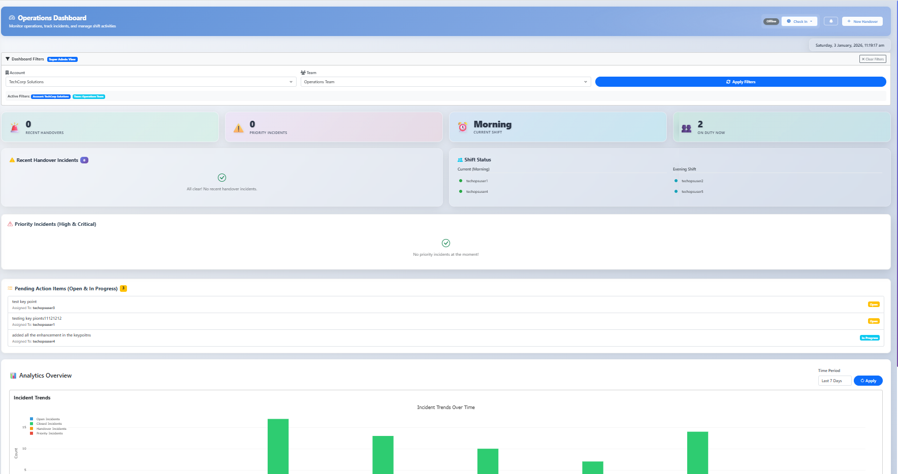

**Super Admin** is the highest privilege level with complete system access.

#### Capabilities:
- ✅ Full access to all accounts and teams
- ✅ System-wide configuration
- ✅ Email/SMTP configuration
- ✅ SSO/OAuth setup
- ✅ ServiceNow integration
- ✅ Create/manage all admin roles
- ✅ View all audit logs
- ✅ Delete draft reports
- ✅ Manage application settings

#### Typical Users:
- IT Administrators
- System Owners
- DevOps Engineers

---

### 2.2 Account Admin

<!-- 📸 SCREENSHOT: Account admin dashboard view -->
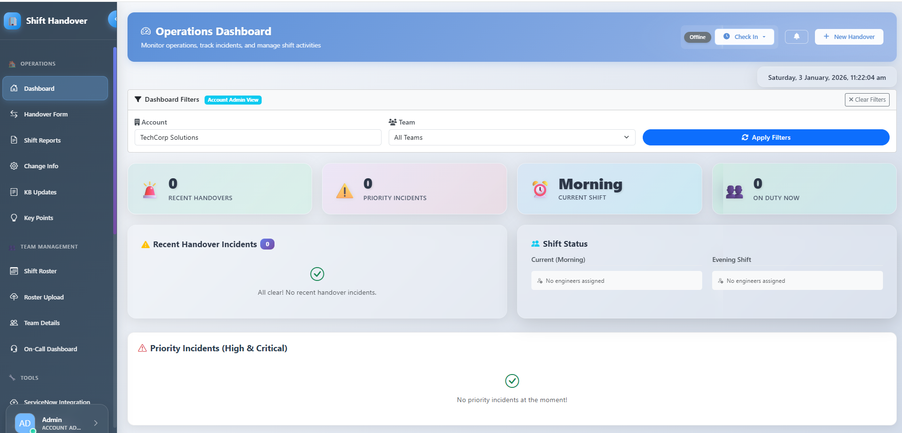

**Account Admin** manages all teams within their assigned account/organization.

#### Capabilities:
- ✅ Manage all teams in their account
- ✅ Create/edit users within account
- ✅ View reports for all teams in account
- ✅ Manage team configurations
- ✅ View account-level audit logs
- ❌ Cannot access other accounts
- ❌ Cannot modify system settings
- ❌ Cannot configure SSO/Email

#### Typical Users:
- Account Managers
- Delivery Managers
- Project Leads

---

### 2.3 Team Admin

<!-- 📸 SCREENSHOT: Team admin dashboard view -->
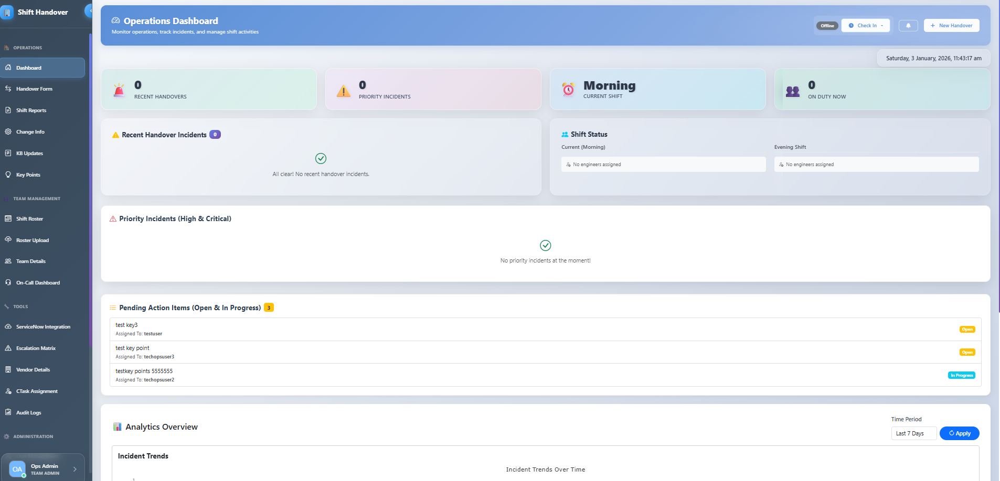

**Team Admin** manages their specific team only.

#### Capabilities:
- ✅ Manage team members
- ✅ Upload/manage shift roster
- ✅ View team reports
- ✅ Configure team settings
- ✅ Generate shift allowance reports
- ❌ Cannot access other teams
- ❌ Cannot create new teams
- ❌ Cannot modify account settings

#### Typical Users:
- Team Leads
- Shift Supervisors
- Senior Engineers

---

### 2.4 Role Comparison Matrix

<!-- 📸 SCREENSHOT: Role comparison table -->
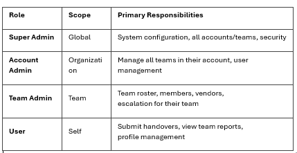

| Feature | Super Admin | Account Admin | Team Admin | User |
|---------|:-----------:|:-------------:|:----------:|:----:|
| **User Management** |
| Create users (all) | ✅ | ❌ | ❌ | ❌ |
| Create users (account) | ✅ | ✅ | ❌ | ❌ |
| Create users (team) | ✅ | ✅ | ✅ | ❌ |
| Edit any user | ✅ | ❌ | ❌ | ❌ |
| Edit account users | ✅ | ✅ | ❌ | ❌ |
| Edit team users | ✅ | ✅ | ✅ | ❌ |
| Assign admin roles | ✅ | ❌ | ❌ | ❌ |
| **Team Management** |
| Create accounts | ✅ | ❌ | ❌ | ❌ |
| Create teams | ✅ | ✅ | ❌ | ❌ |
| Edit team settings | ✅ | ✅ | ✅ | ❌ |
| **Roster Management** |
| Upload roster (any) | ✅ | ✅ | ❌ | ❌ |
| Upload roster (team) | ✅ | ✅ | ✅ | ❌ |
| View roster (any) | ✅ | ✅ | ❌ | ❌ |
| View roster (team) | ✅ | ✅ | ✅ | ✅ |
| **Reports** |
| View all reports | ✅ | ❌ | ❌ | ❌ |
| View account reports | ✅ | ✅ | ❌ | ❌ |
| View team reports | ✅ | ✅ | ✅ | ✅ |
| Export reports | ✅ | ✅ | ✅ | ✅ |
| Delete draft reports | ✅ | ❌ | ❌ | ❌ |
| **System Configuration** |
| Email/SMTP config | ✅ | ❌ | ❌ | ❌ |
| SSO configuration | ✅ | ❌ | ❌ | ❌ |
| ServiceNow setup | ✅ | ❌ | ❌ | ❌ |
| App settings | ✅ | ❌ | ❌ | ❌ |
| **Audit & Monitoring** |
| View all audit logs | ✅ | ❌ | ❌ | ❌ |
| View account audit logs | ✅ | ✅ | ❌ | ❌ |
| View team audit logs | ✅ | ✅ | ✅ | ❌ |
| System health monitoring | ✅ | ❌ | ❌ | ❌ |

---

## 3. Super Admin Features

### 3.1 Account Management

<!-- 📸 SCREENSHOT: Account management page -->
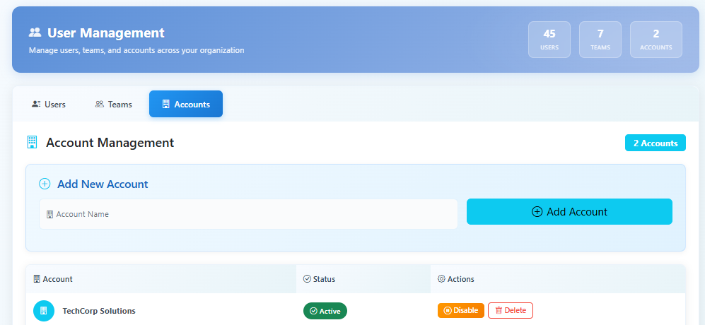

Super Admins can create and manage accounts (organizations).

#### Accessing Account Management

1. Click **"Admin"** in the sidebar
2. Select **"Accounts"**

#### Creating a New Account

<!-- 📸 SCREENSHOT: Create account form -->
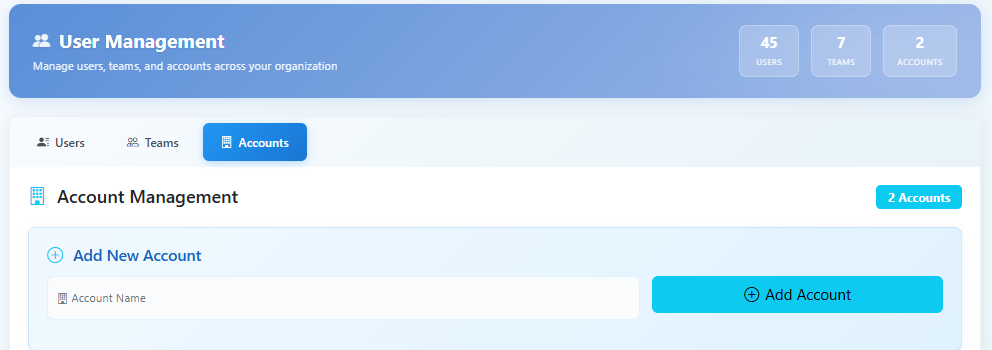

1. Click **"+ Add Account"** button
2. Fill in account details:

| Field | Description | Required |
|-------|-------------|:--------:|
| **Account Name** | Organization name | ✅ |
| **Description** | Brief description | ❌ |
| **Is Active** | Enable/disable account | ✅ |

3. Click **"Save"**

#### Editing an Account

1. Find the account in the list
2. Click **"Edit"** button
3. Modify details
4. Click **"Save"**

#### Deactivating an Account

> ⚠️ **Warning:** Deactivating an account will prevent all users in that account from logging in.

1. Edit the account
2. Uncheck **"Is Active"**
3. Save changes

---

### 3.2 Global User Management

<!-- 📸 SCREENSHOT: Global user management -->
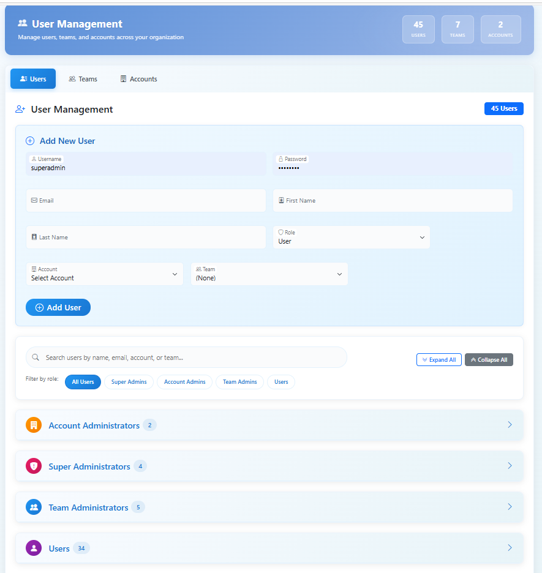

Super Admins can manage all users across all accounts.

#### Accessing User Management

1. Click **"Admin"** in the sidebar
2. Select **"Users"**

#### User List Features

| Feature | Description |
|---------|-------------|
| **Search** | Find users by name, email, username |
| **Filter by Account** | Show users from specific account |
| **Filter by Team** | Show users from specific team |
| **Filter by Role** | Show users with specific role |
| **Export** | Export user list to CSV |

#### Creating a User

<!-- 📸 SCREENSHOT: Create user form -->
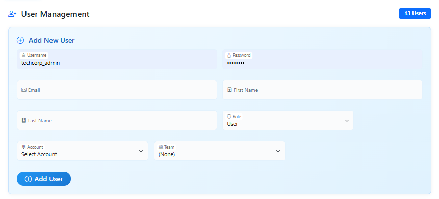

1. Click **"+ Add User"** button
2. Fill in user details:

| Field | Description | Required |
|-------|-------------|:--------:|
| **Username** | Login username (unique) | ✅ |
| **Email** | User email address | ✅ |
| **First Name** | User's first name | ❌ |
| **Last Name** | User's last name | ❌ |
| **Password** | Initial password | ✅ |
| **Account** | Assign to account | ✅ |
| **Team** | Assign to team | ✅ |
| **Role** | User role | ✅ |

3. Click **"Create User"**

#### Assigning Admin Roles

Only Super Admins can assign administrative roles:

1. Edit the user
2. Select role from dropdown:
   - `user` - Regular user
   - `team_admin` - Team Administrator
   - `account_admin` - Account Administrator
   - `super_admin` - Super Administrator
3. Save changes

---

### 3.3 System Configuration

<!-- 📸 SCREENSHOT: System configuration menu -->
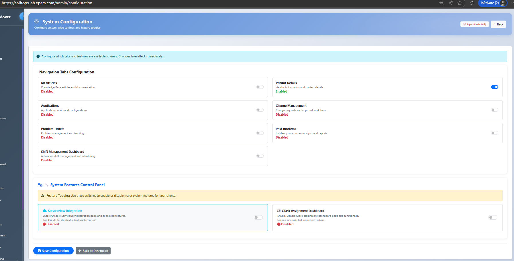

Super Admins have access to system-wide configuration options.

#### Accessing System Configuration

1. Click **"Admin"** in the sidebar
2. Select **"Configuration"**

#### Configuration Sections

| Section | Description |
|---------|-------------|
| **Email/SMTP** | Configure email sending |
| **SSO/OAuth** | Configure single sign-on |
| **ServiceNow** | API integration settings |
| **App Settings** | General application settings |

---

### 3.4 Email Configuration

<!-- 📸 SCREENSHOT: Email configuration page -->
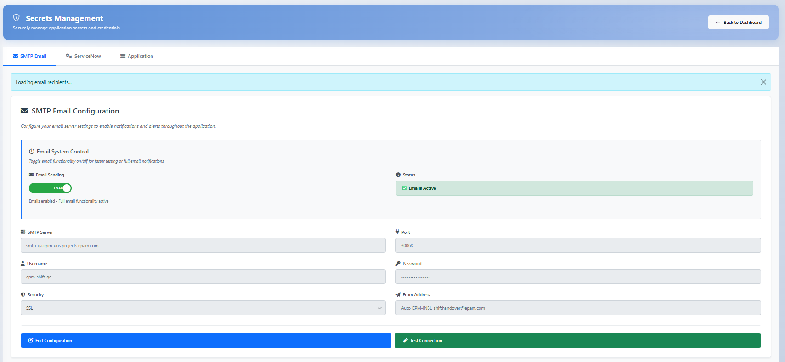

Configure SMTP settings for sending handover emails.

#### SMTP Settings

| Setting | Description | Example |
|---------|-------------|---------|
| **SMTP Server** | Mail server hostname | smtp.gmail.com |
| **SMTP Port** | Server port | 587 |
| **Use TLS** | Enable TLS encryption | Yes |
| **Username** | SMTP authentication username | user@domain.com |
| **Password** | SMTP authentication password | ******** |
| **From Email** | Sender email address | shiftops@domain.com |
| **From Name** | Sender display name | ShiftOps System |

#### Testing Email Configuration

<!-- 📸 SCREENSHOT: Email test button -->
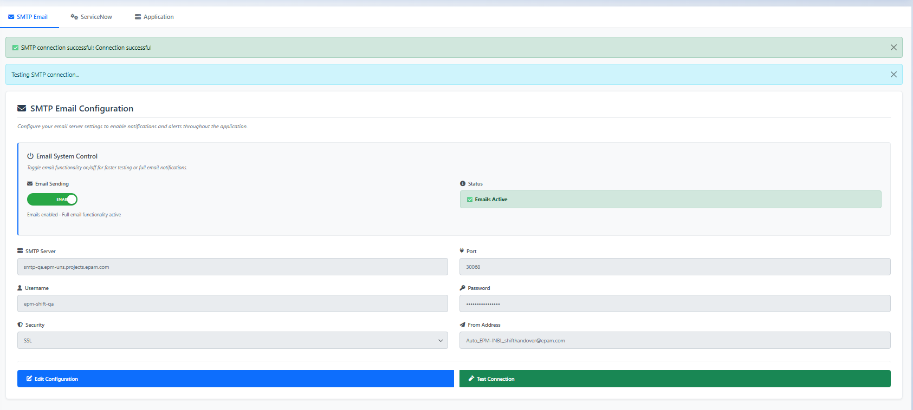

1. Click **"Test Connection"** button
2. Enter a test email address
3. Click **"Send Test Email"**
4. Check if email was received
5. Verify email content and formatting

#### Team-Specific Email Settings

<!-- 📸 SCREENSHOT: Team email configuration -->
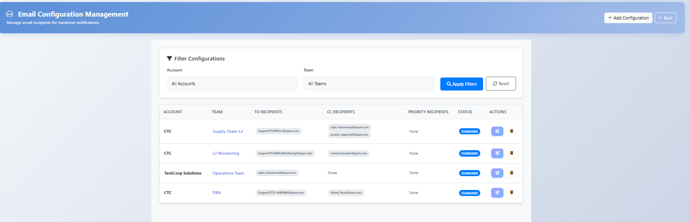

Configure email recipients per team:

1. Go to **"Team Email Configuration"**
2. Select a team
3. Add recipient email addresses:
   - **TO Recipients** - Primary recipients
   - **CC Recipients** - Carbon copy recipients
4. Save settings

---

### 3.5 SSO Configuration

<!-- 📸 SCREENSHOT: SSO configuration page -->
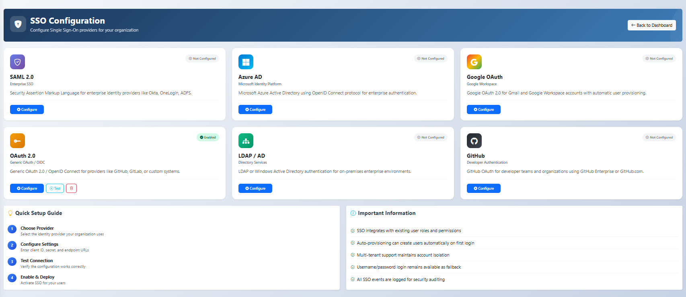

Configure Single Sign-On integration.

#### OAuth 2.0 Settings

| Setting | Description |
|---------|-------------|
| **Client ID** | OAuth application client ID |
| **Client Secret** | OAuth application secret |
| **Authorization URL** | OAuth authorization endpoint |
| **Token URL** | OAuth token endpoint |
| **Userinfo URL** | User information endpoint |
| **Redirect URI** | Application callback URL |
| **Scope** | OAuth scopes requested |

#### SSO Claim Mapping

Configure how SSO claims map to application fields:

| SSO Claim | Application Field |
|-----------|-------------------|
| `email` | User email |
| `name` | Display name |
| `preferred_username` | Username |
| `groups` | Role assignment |

#### Testing SSO

<!-- 📸 SCREENSHOT: SSO test button -->
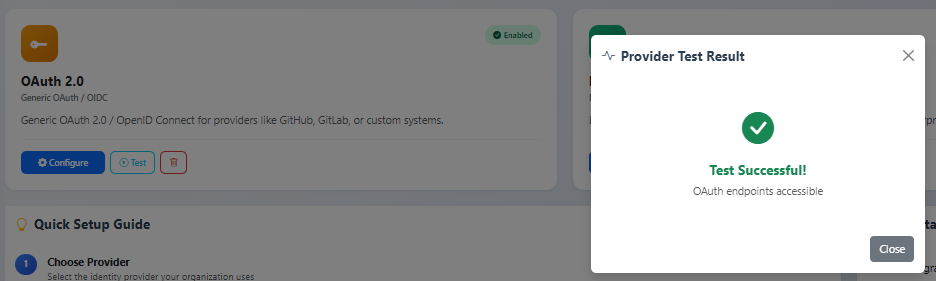

1. Click **"Test SSO"** button
2. Complete the SSO login flow
3. Review the returned claims
4. Verify mapping is correct

---

### 3.6 ServiceNow Integration

<!-- 📸 SCREENSHOT: ServiceNow configuration -->
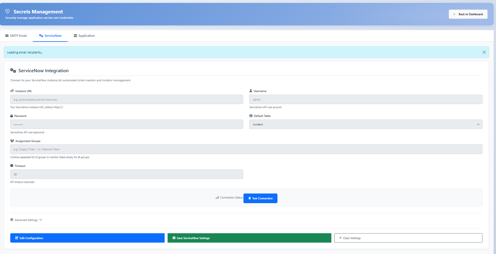

Configure ServiceNow API integration for incident data.

#### ServiceNow Settings

| Setting | Description |
|---------|-------------|
| **Instance URL** | ServiceNow instance URL |
| **Username** | API username |
| **Password** | API password |
| **API Endpoint** | Table API endpoint |

#### Testing Connection

1. Click **"Test Connection"**
2. Verify connection status
3. Test incident retrieval

---

### 3.7 App Configuration

<!-- 📸 SCREENSHOT: App configuration page -->
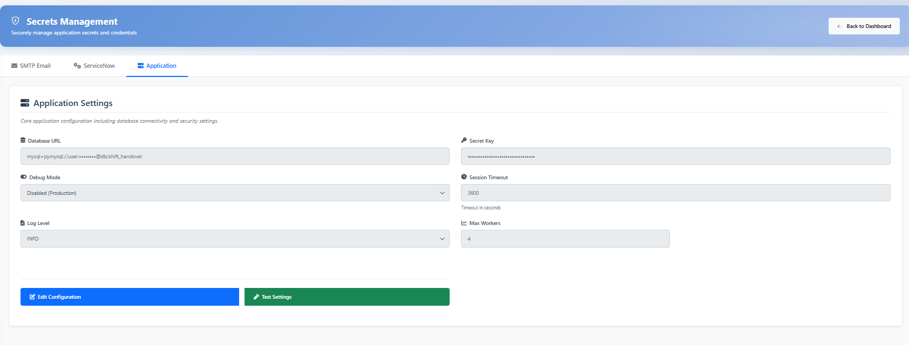

Configure general application settings.

#### Available Settings

| Setting | Description | Default |
|---------|-------------|---------|
| **Email Notifications** | Enable/disable email sending | Enabled |
| **Maintenance Mode** | Put app in maintenance mode | Disabled |
| **Session Timeout** | Auto-logout time (minutes) | 60 |
| **Max File Upload** | Maximum upload size (MB) | 10 |

---

### 3.8 Delete Draft Reports

<!-- 📸 SCREENSHOT: Delete draft report feature -->


Super Admins can delete draft reports from any team.

#### Deleting a Draft Report

1. Go to **"Reports"** page
2. Find the draft report
3. Click the red **"Delete"** button
4. Confirm deletion in the modal
5. Report and all associated data will be removed

> ⚠️ **Warning:** This action is irreversible. All incidents, key points, change info, and KB updates associated with the draft will be deleted.

---

### 3.9 Global Audit Logs

<!-- 📸 SCREENSHOT: Global audit logs -->
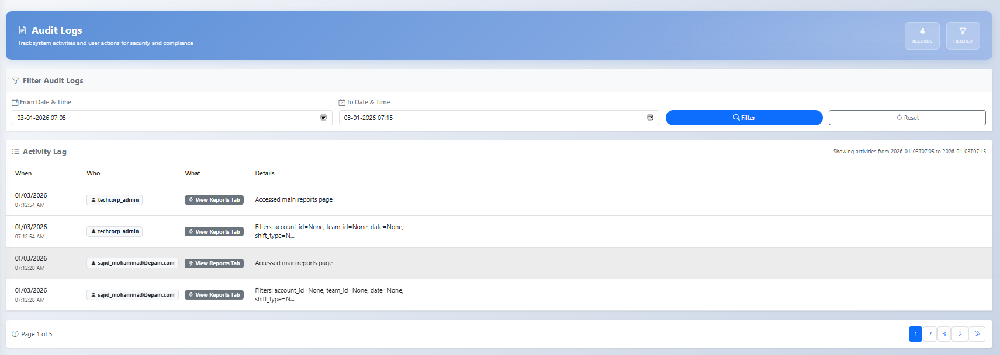

View all system activity across all accounts and teams.

#### Audit Log Information

| Field | Description |
|-------|-------------|
| **Timestamp** | When the action occurred |
| **User** | Who performed the action |
| **Action** | What action was taken |
| **Details** | Additional context |
| **Account** | Which account |
| **Team** | Which team |
| **IP Address** | Source IP |

#### Filtering Audit Logs

- Filter by date range
- Filter by user
- Filter by action type
- Filter by account
- Filter by team
- Search by keyword

#### Exporting Audit Logs

1. Apply desired filters
2. Click **"Export"** button
3. Download CSV file

---

## 4. Account Admin Features

### 4.1 Team Management

<!-- 📸 SCREENSHOT: Team management for account admin -->
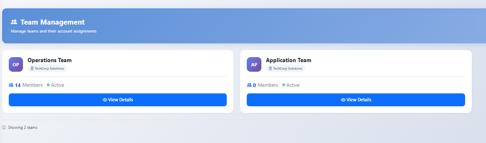

Account Admins can create and manage teams within their account.

#### Creating a New Team

<!-- 📸 SCREENSHOT: Create team form -->


1. Click **"+ Add Team"** button
2. Fill in team details:

| Field | Description | Required |
|-------|-------------|:--------:|
| **Team Name** | Team identifier | ✅ |
| **Description** | Team description | ❌ |
| **Is Active** | Enable/disable team | ✅ |

3. Click **"Save"**

#### Team Settings

Configure team-specific settings:

- Team email recipients
- Default shift types
- Roster settings

---

### 4.2 Account-Level User Management

<!-- 📸 SCREENSHOT: Account user management -->
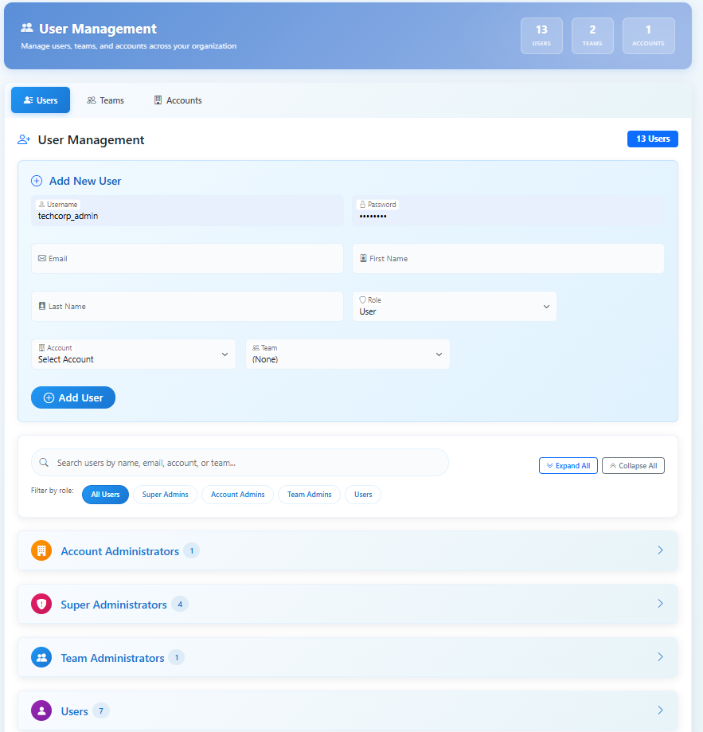

Account Admins can manage users within their account.

#### Capabilities

- ✅ Create new users in any team within the account
- ✅ Edit users in the account
- ✅ Assign users to teams
- ✅ Reset passwords
- ❌ Cannot assign super_admin role
- ❌ Cannot assign account_admin role (only super_admin can)

---

### 4.3 Account Reports

<!-- 📸 SCREENSHOT: Account reports view -->
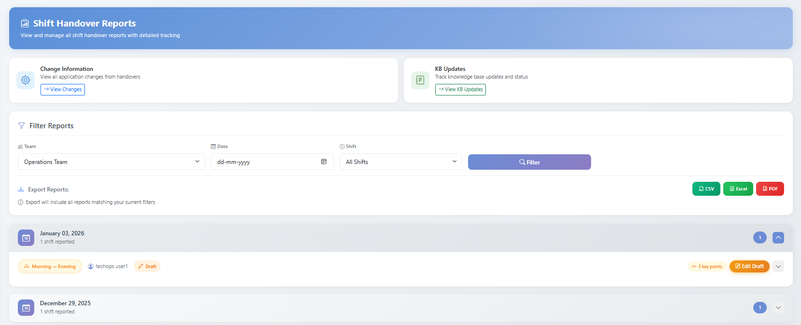

View and export reports for all teams in the account.

#### Multi-Team View

1. Go to **"Reports"**
2. Use team filter to select specific teams or "All Teams"
3. View consolidated reports
4. Export across teams

---

### 4.4 Account Audit Logs

<!-- 📸 SCREENSHOT: Account audit logs -->
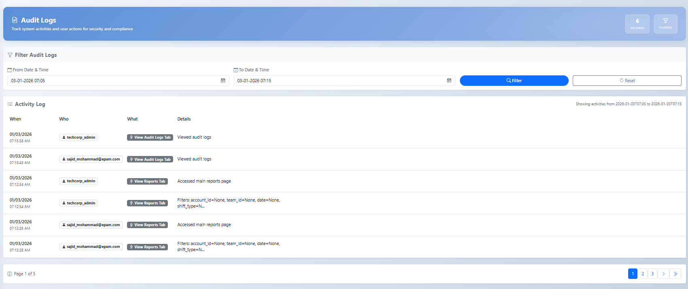

View audit logs for all activities within the account.

---

## 5. Team Admin Features

### 5.1 Team Member Management

<!-- 📸 SCREENSHOT: Team member management -->


Team Admins can manage members within their team.

#### Adding Team Members

<!-- 📸 SCREENSHOT: Add team member -->


1. Go to **"Team Details"**
2. Click **"+ Add Member"**
3. Enter member details:
   - Name
   - Email
   - Phone (optional)
4. Click **"Save"**

#### Linking Users to Team Members

<!-- 📸 SCREENSHOT: User-member linking -->
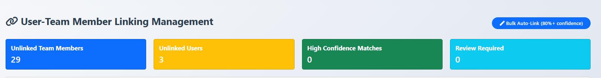

Link application users to team members:

1. Go to **"User-Team Linking"**
2. Select a user
3. Select corresponding team member
4. Click **"Link"**

---

### 5.2 Roster Management

<!-- 📸 SCREENSHOT: Roster management for team admin -->
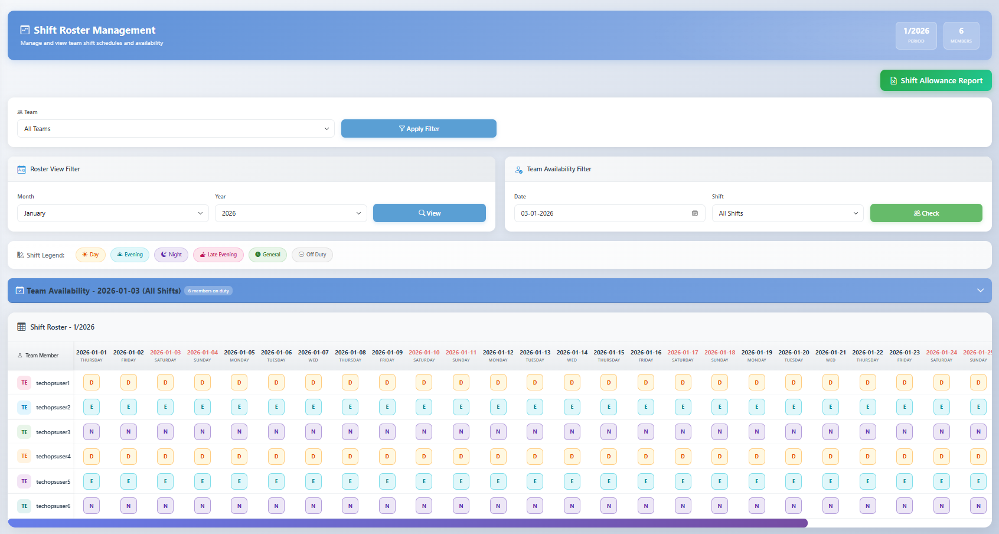

Team Admins can manage the shift roster for their team.

#### Uploading Roster

<!-- 📸 SCREENSHOT: Roster upload page -->
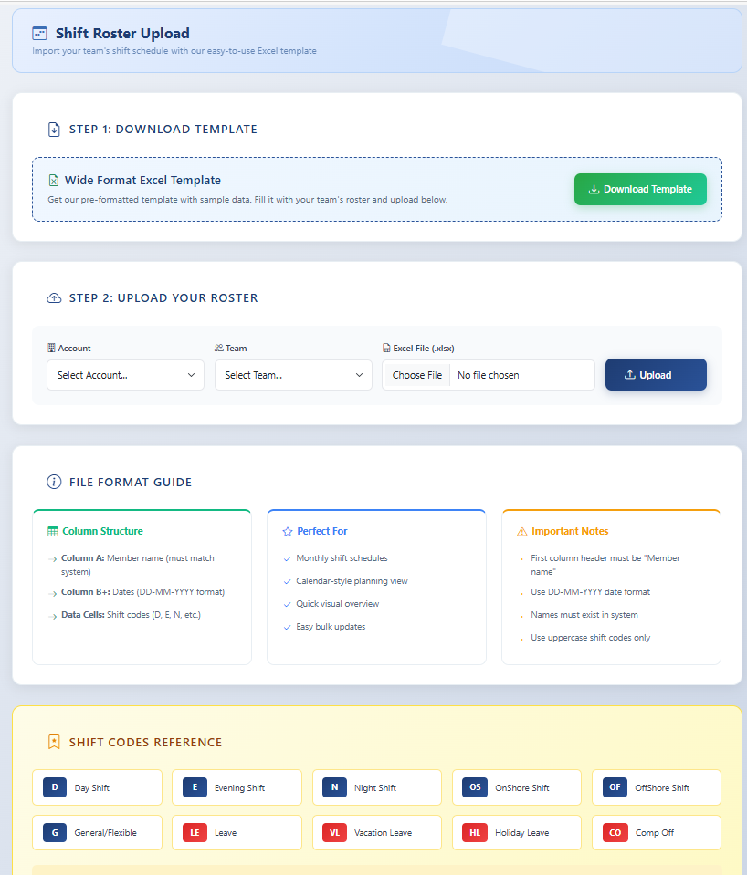

1. Go to **"Shift Roster"**
2. Click **"Upload Roster"**
3. Select month and year
4. Upload Excel file following template format
5. Click **"Upload"**
6. Review and confirm imported data

#### Roster Template Format

| Column | Description | Format |
|--------|-------------|--------|
| **Date** | Shift date | DD/MM/YYYY |
| **Engineer Name** | Team member name | Text |
| **Shift Type** | Morning/Evening/Night/OnShore/OffShore | Text |
| **Leave** | On leave indicator | Yes/No |

---

### 5.3 Team Reports

<!-- 📸 SCREENSHOT: Team reports -->
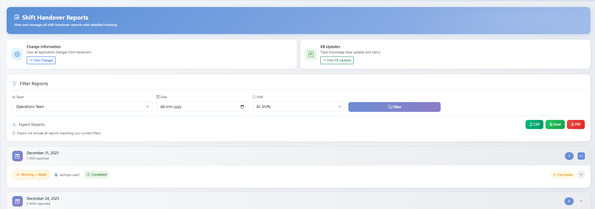

View and manage reports for your team only.

#### Team Admin Report Actions

- View all team handovers
- Export team reports
- Generate shift allowance reports
- View team statistics

---

### 5.4 Team Configuration

<!-- 📸 SCREENSHOT: Team configuration -->


Configure team-specific settings:

| Setting | Description |
|---------|-------------|
| **Email Recipients** | Who receives handover emails |
| **Default Shift Types** | Available shift options |
| **Escalation Contacts** | Team escalation matrix |
| **On-Call Schedule** | On-call rotation settings |

---

## 6. User Management

### 6.1 Creating Users

<!-- 📸 SCREENSHOT: User creation workflow -->
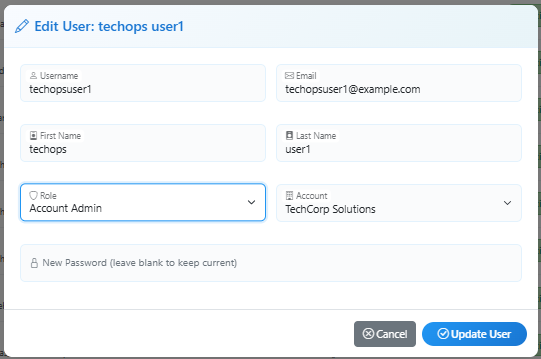

Step-by-step user creation:

1. **Access User Management**
   - Navigate to Admin → Users
   - Click **"+ Add User"**

2. **Enter Basic Information**
   - Username (required, unique)
   - Email address (required)
   - First name, Last name (optional)

3. **Set Password**
   - Enter initial password (min 6 characters)
   - User can change on first login

4. **Assign Account & Team**
   - Select account from dropdown
   - Select team from dropdown

5. **Assign Role**
   - Select appropriate role level

6. **Save User**
   - Click **"Create User"**
   - User receives confirmation

---

### 6.2 Editing Users

<!-- 📸 SCREENSHOT: User edit form -->
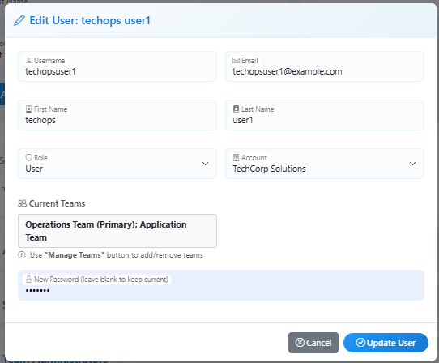

Modify existing user details:

1. Find user in the list
2. Click **"Edit"** button
3. Modify fields as needed
4. Click **"Save Changes"**

#### Editable Fields

| Field | Who Can Edit |
|-------|--------------|
| First/Last Name | All admins |
| Email | All admins |
| Password | All admins (reset) |
| Account | Super Admin only |
| Team | Account Admin+ |
| Role | Super Admin only |
| Active Status | Account Admin+ |

---

### 6.3 Role Assignment

<!-- 📸 SCREENSHOT: Role assignment dropdown -->
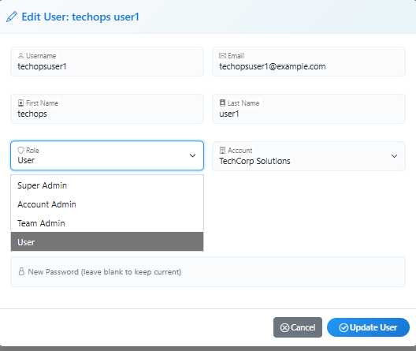

#### Role Assignment Rules

| Your Role | Can Assign |
|-----------|------------|
| Super Admin | All roles |
| Account Admin | user, team_admin (within account) |
| Team Admin | Cannot assign roles |

#### Changing Roles

1. Edit the user
2. Select new role from dropdown
3. Save changes
4. User permissions update immediately

> **Note:** Demoting an admin to user will revoke all admin privileges immediately.

---

### 6.4 Deactivating Users

<!-- 📸 SCREENSHOT: User deactivation -->
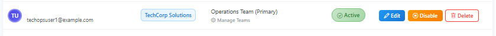

Disable user access without deleting:

1. Edit the user
2. Uncheck **"Is Active"**
3. Save changes

#### Effects of Deactivation

- User cannot login
- User data is preserved
- User appears in reports/audit logs
- Can be reactivated later

---

### 6.5 Password Reset

<!-- 📸 SCREENSHOT: Password reset -->
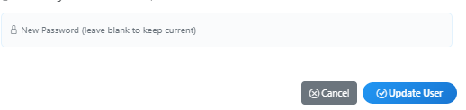

Reset a user's password:

1. Edit the user
2. Click **"Reset Password"**
3. Enter new password
4. Confirm password
5. Click **"Update Password"**

> **Note:** User will need to login with the new password.

---

## 7. Team Management

### 7.1 Creating Teams

<!-- 📸 SCREENSHOT: Team creation form -->


Create a new team (Account Admin+ only):

1. Go to Admin → Teams
2. Click **"+ Add Team"**
3. Fill in details:
   - Team Name
   - Description
   - Account (auto-filled for Account Admin)
4. Click **"Save"**

---

### 7.2 Team Configuration

<!-- 📸 SCREENSHOT: Team configuration options -->
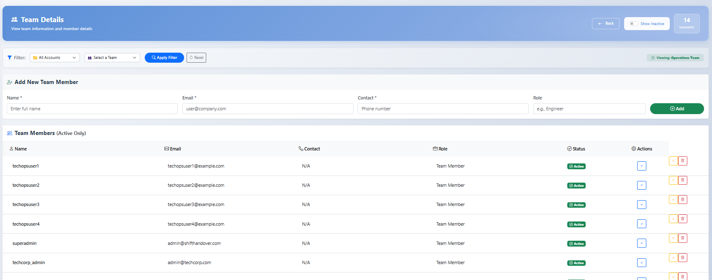

Configure team settings:

| Setting | Description |
|---------|-------------|
| **Team Name** | Display name |
| **Description** | Team description |
| **Is Active** | Enable/disable team |
| **Shift Types** | Available shifts for this team |

---

### 7.3 Team Email Settings

<!-- 📸 SCREENSHOT: Team email settings -->


Configure handover email recipients:

1. Go to Team Configuration
2. Click **"Email Settings"**
3. Add TO recipients
4. Add CC recipients
5. Save settings

#### Email Recipient Format

```
TO: team-lead@company.com, manager@company.com
CC: stakeholder@company.com, dl-team@company.com
```

---

### 7.4 Team Member Linking

<!-- 📸 SCREENSHOT: Team member linking page -->
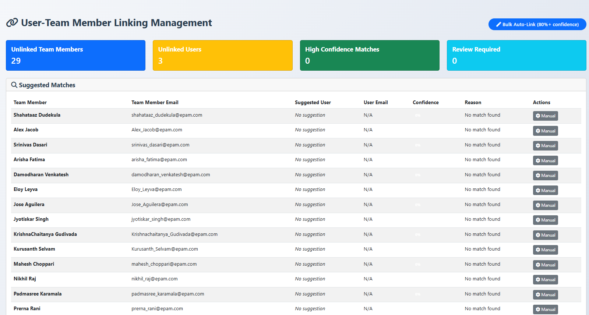

Link application users to team roster members:

1. Go to **"User-Team Linking"**
2. View unlinked users and members
3. Match users to team members
4. Click **"Link"**

#### Why Link Users?

- Enables automatic shift detection
- Validates handover submissions
- Populates engineer dropdowns correctly

---

## 8. Roster Administration

### 8.1 Roster Upload

<!-- 📸 SCREENSHOT: Roster upload interface -->
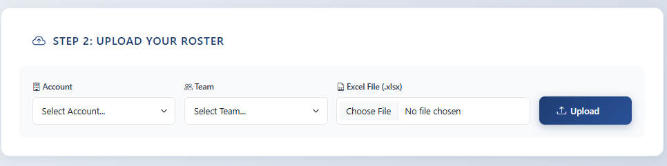

Bulk upload shift roster from Excel:

#### Step 1: Download Template

1. Click **"Download Template"**
2. Open the Excel template

#### Step 2: Fill Template

| Date | Engineer Name | Shift Type | Leave |
|------|---------------|------------|-------|
| 01/01/2026 | John Doe | Morning | No |
| 01/01/2026 | Jane Smith | Evening | No |
| 02/01/2026 | John Doe | Night | No |

#### Step 3: Upload

1. Click **"Upload Roster"**
2. Select month and year
3. Choose the filled Excel file
4. Click **"Upload"**

#### Step 4: Review & Confirm

<!-- 📸 SCREENSHOT: Roster review page -->
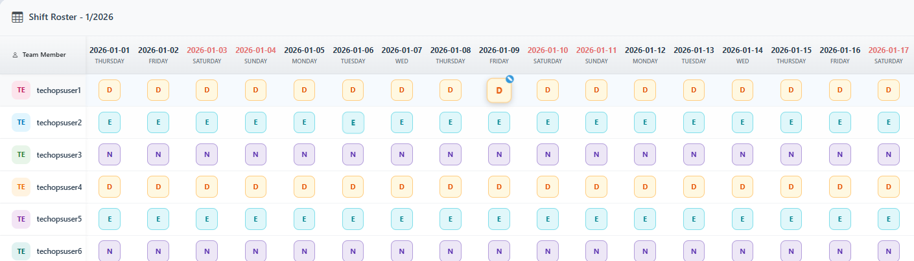

1. Review imported data
2. Fix any errors
3. Click **"Confirm Import"**

---

### 8.2 Manual Roster Entry

<!-- 📸 SCREENSHOT: Manual roster entry -->
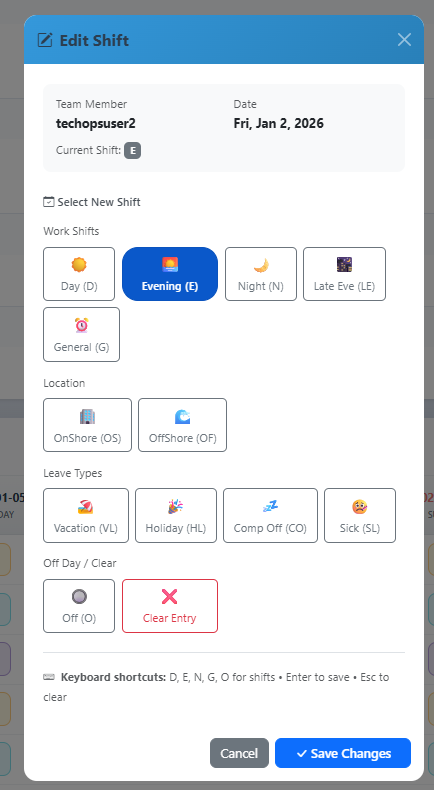

Add individual roster entries:

1. Go to Shift Roster
2. Click on a calendar cell
3. Select engineer and shift type
4. Save entry

---

### 8.3 Shift Allowance Reports

<!-- 📸 SCREENSHOT: Shift allowance report -->
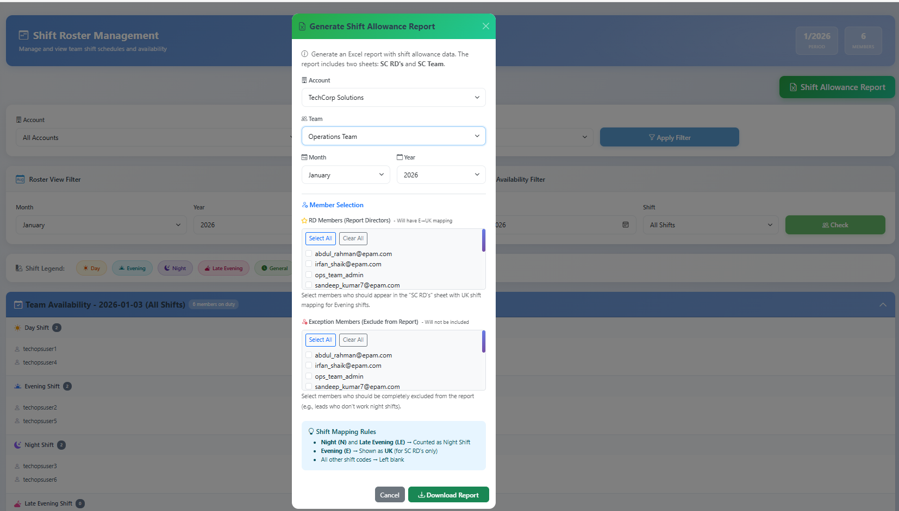

Generate shift allowance reports:

1. Click **"Shift Allowance"** button
2. Select Month
3. Select Year
4. Click **"Generate Report"**
5. Download Excel file

#### Report Contents

- Engineer names
- Shift counts by type
- Total shifts worked
- Leave days
- Allowance calculations

---

### 8.4 Roster Templates

<!-- 📸 SCREENSHOT: Roster template download -->
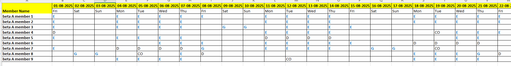

Download roster templates:

1. Click **"Download Template"**
2. Choose template format
3. Fill with team member data
4. Upload when ready

---

## 9. System Configuration

### 9.1 SMTP Email Setup

<!-- 📸 SCREENSHOT: SMTP setup wizard -->


Configure email sending (Super Admin only):

#### Common SMTP Configurations

**Gmail:**
```
Server: smtp.gmail.com
Port: 587
TLS: Yes
Username: your-email@gmail.com
Password: App Password (not regular password)
```

**Office 365:**
```
Server: smtp.office365.com
Port: 587
TLS: Yes
Username: your-email@company.com
Password: Account password
```

**Custom SMTP:**
```
Server: mail.yourserver.com
Port: 25 or 587
TLS: As required
Username: As configured
Password: As configured
```

---

### 9.2 SSO/OAuth Configuration

<!-- 📸 SCREENSHOT: SSO configuration wizard -->
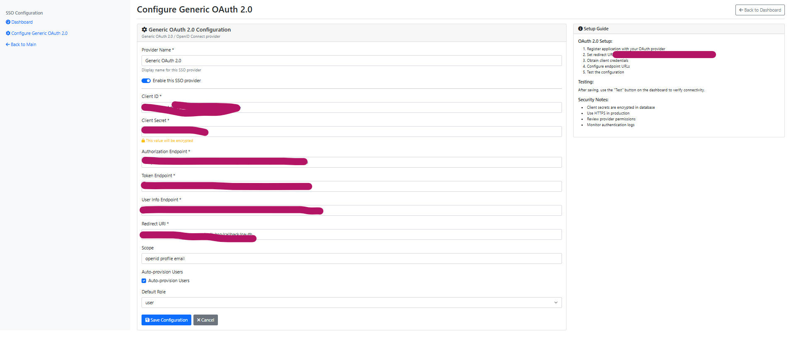

Configure Single Sign-On:

#### EPAM SSO Settings

```
Authorization URL: https://auth.epam.com/oauth2/authorize
Token URL: https://auth.epam.com/oauth2/token
Userinfo URL: https://auth.epam.com/oauth2/userinfo
Scope: openid profile email
```

---

### 9.3 ServiceNow API Setup

<!-- 📸 SCREENSHOT: ServiceNow API setup -->
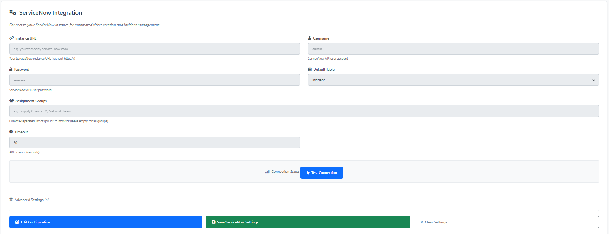

Configure ServiceNow integration:

1. Enter Instance URL
2. Enter API credentials
3. Test connection
4. Configure field mappings

---

### 9.4 Application Settings

<!-- 📸 SCREENSHOT: Application settings -->
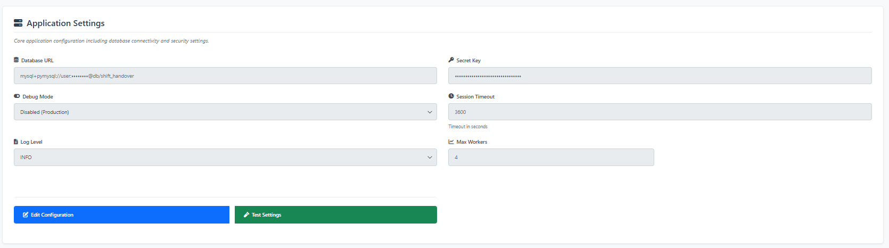

General application configuration:

| Setting | Options | Description |
|---------|---------|-------------|
| **Email Notifications** | On/Off | Global email toggle |
| **Maintenance Mode** | On/Off | Show maintenance page |
| **Debug Mode** | On/Off | Enable detailed logging |
| **Session Timeout** | 15-120 min | Auto-logout time |

---

## 10. Monitoring & Audit

### 10.1 Audit Logs

<!-- 📸 SCREENSHOT: Audit log viewer -->
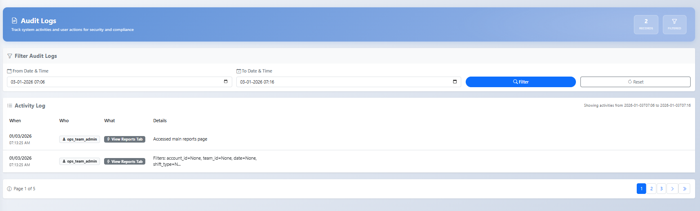

Monitor all system activity:

#### Tracked Actions

| Action Type | Description |
|-------------|-------------|
| **Login** | User login attempts |
| **Logout** | User logout |
| **Create** | Record creation |
| **Update** | Record modification |
| **Delete** | Record deletion |
| **Export** | Data export |
| **Config** | Configuration changes |

#### Audit Log Retention

- Logs retained for 90 days by default
- Export logs before retention period
- Contact Super Admin for longer retention

---

### 10.2 System Health

<!-- 📸 SCREENSHOT: System health dashboard -->
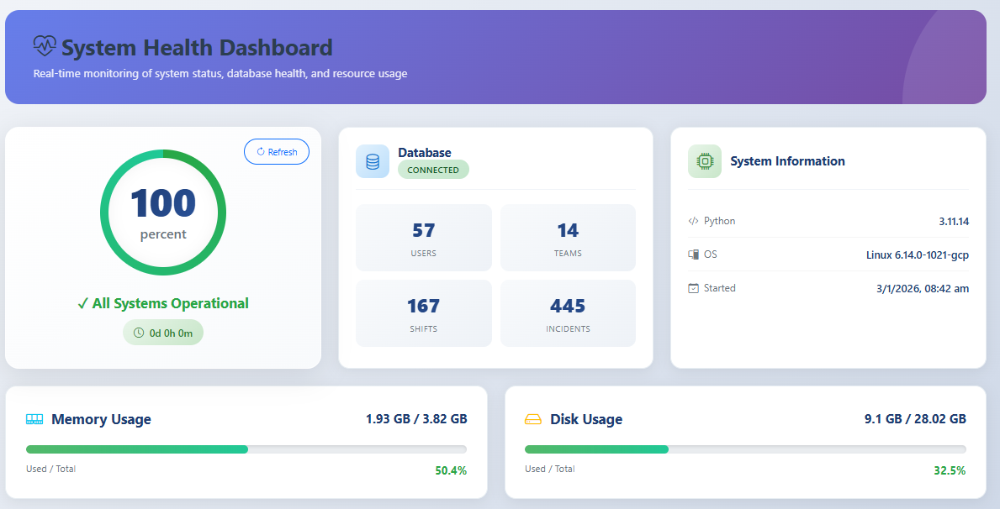

Monitor system status:

#### Health Indicators

| Service | Checks |
|---------|--------|
| **Database** | Connection, query time |
| **Email** | SMTP connectivity |
| **Application** | Response time, errors |
| **Disk** | Storage space |
| **Memory** | RAM usage |

---

### 10.3 Email Monitoring

<!-- 📸 SCREENSHOT: Email monitoring -->
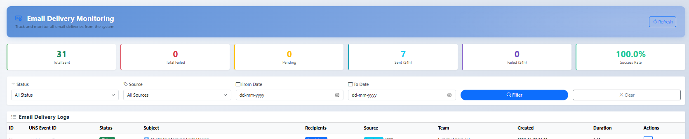

Track email delivery:

- Sent emails log
- Delivery status
- Failed email alerts
- Retry failed emails

---

## 11. Troubleshooting

### Common Issues and Solutions

#### Users Cannot Login

| Issue | Solution |
|-------|----------|
| Wrong password | Reset password |
| Account inactive | Activate account |
| User inactive | Activate user |
| SSO issues | Check SSO configuration |

#### Emails Not Sending

| Issue | Solution |
|-------|----------|
| SMTP not configured | Configure SMTP settings |
| Wrong credentials | Verify username/password |
| Port blocked | Try different port (587, 465, 25) |
| TLS issues | Check TLS settings |

#### Roster Upload Fails

| Issue | Solution |
|-------|----------|
| Wrong format | Use correct template |
| Invalid dates | Check date format |
| Unknown engineers | Add engineers to team first |

---

## 12. Best Practices

### Security Best Practices

1. **Password Policy**
   - Enforce minimum 8 characters
   - Require complexity
   - Regular password changes

2. **Role Assignment**
   - Follow principle of least privilege
   - Regular role audits
   - Remove unused admin accounts

3. **Audit Review**
   - Weekly audit log review
   - Investigate unusual activity
   - Document security incidents

### Operational Best Practices

1. **User Management**
   - Deactivate instead of delete
   - Keep user records for audit
   - Regular user access review

2. **Team Management**
   - Keep teams organized
   - Regular roster updates
   - Clear team ownership

3. **Configuration Management**
   - Document all configuration changes
   - Test in non-production first
   - Backup before major changes

---

## Document History

| Version | Date | Changes |
|---------|------|---------|
| 2.0.0 | Jan 2, 2026 | Complete admin documentation |
| 1.0.0 | Oct 2025 | Initial admin guide |

---

**© 2026 EPAM Systems. All Rights Reserved.**

*For questions about this documentation, contact: sajid_mohammad@epam.com*

