# ShiftOps - Shift Handover Application
## Complete User Guide & Documentation

**Version:** 2.0.0  
**Last Updated:** January 2, 2026  
**Author:** EPAM Systems

---

## Table of Contents

1. [Introduction](#1-introduction)
2. [Getting Started](#2-getting-started)
   - [Login](#21-login)
   - [SSO Authentication](#22-sso-authentication)
   - [Dashboard Overview](#23-dashboard-overview)
   - [Multi-Team Access](#24-multi-team-access)
3. [Operations](#3-operations)
   - [Shift Handover Form](#31-shift-handover-form)
   - [Shift Handover Reports](#32-shift-handover-reports)
   - [Key Points Management](#33-key-points-management)
4. [Tools](#4-tools)
   - [Change Info Management](#41-change-info-management)
   - [KB Updates](#42-kb-updates)
   - [Vendor Details](#43-vendor-details)
   - [CTask Assignment](#44-ctask-assignment)
5. [Roster & Scheduling](#5-roster--scheduling)
   - [Shift Roster](#51-shift-roster)
   - [Team Details](#52-team-details)
   - [Shift Management](#53-shift-management)
6. [Support Tools](#6-support-tools)
   - [OnCall Dashboard](#61-oncall-dashboard)
   - [Escalation Matrix](#62-escalation-matrix)
   - [ServiceNow Integration](#63-servicenow-integration)
7. [Knowledge Base](#7-knowledge-base)
   - [KB Articles](#71-kb-articles)
   - [Applications](#72-applications)
   - [Change Management Dashboard](#73-change-management-dashboard)
8. [Administration](#8-administration)
   - [User Management](#81-user-management)
   - [Audit Logs](#82-audit-logs)
9. [Account Settings](#9-account-settings)
   - [My Profile](#81-my-profile)
   - [Account Settings](#82-account-settings)
   - [Notifications](#83-notifications)
   - [System Alerts](#84-system-alerts)
10. [Help & Support](#10-help--support)
11. [About](#11-about)

---

## 1. Introduction

### What is ShiftOps?

ShiftOps is a comprehensive shift handover management system designed to streamline the transition of responsibilities between shift teams. It provides a centralized platform for:

- **Shift Handover Documentation** - Record incidents, key points, and important updates
- **Change Management** - Track scheduled changes and their implementation status
- **Knowledge Base** - Maintain and share KB articles across teams
- **Roster Management** - Manage shift schedules and team assignments
- **Escalation Tracking** - Define and access escalation paths quickly

### Key Features

| Feature | Description |
|---------|-------------|
| 🔄 Shift Handover | Comprehensive handover forms with incidents, key points, and notes |
| 📊 Reports | Detailed shift reports with export capabilities (CSV, Excel, PDF) |
| 👥 Team Management | Multi-account, multi-team support with role-based access |
| 📅 Shift Roster | Visual calendar-based roster management |
| 🔔 Notifications | Real-time notifications for handovers and assignments |
| 🔐 SSO Integration | EPAM Single Sign-On support |

---

## 2. Getting Started

### 2.1 Login

> **📌 Page Description:** The Login page is the entry point to ShiftOps, providing secure authentication through EPAM SSO or traditional credentials for authorized users to access the shift handover system.

The ShiftOps application supports two authentication methods:

#### SSO Login (Recommended)

<!-- 📸 SCREENSHOT: Login page showing SSO button -->
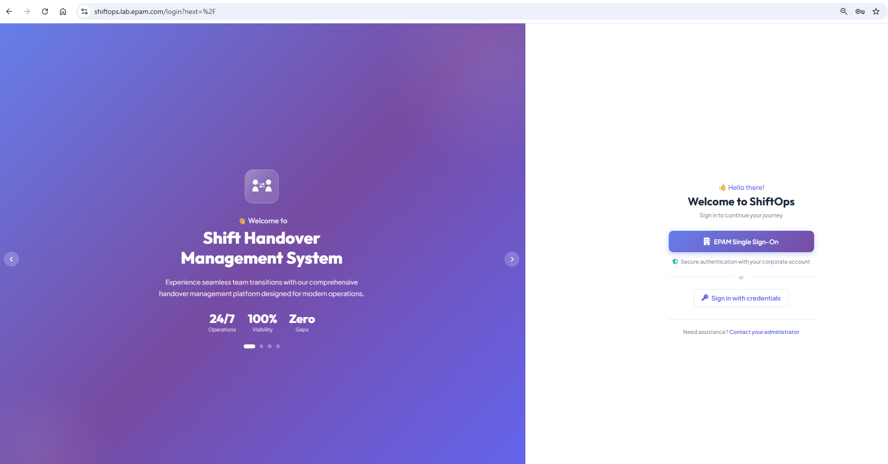

1. Navigate to `https://shiftops.lab.epam.com`
2. Click the **"EPAM Single Sign-On"** button
3. You will be redirected to the EPAM SSO portal
4. Enter your EPAM credentials
5. Upon successful authentication, you'll be redirected to the Dashboard

#### Credentials Login

<!-- 📸 SCREENSHOT: Login page showing credentials form -->
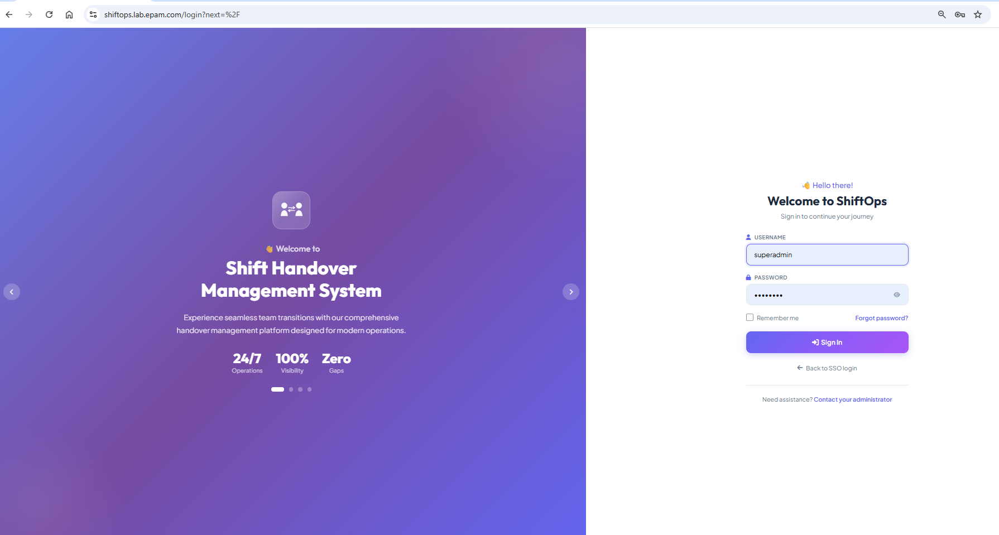

1. Click **"Sign in with credentials"** link
2. Select your **Organization** from the dropdown
3. Select your **Team** from the dropdown
4. Enter your **Username** and **Password**
5. Click **"Sign In"**

> **Note:** Contact your administrator if you don't have login credentials.

---

### 2.2 SSO Authentication

<!-- 📸 SCREENSHOT: EPAM SSO portal -->
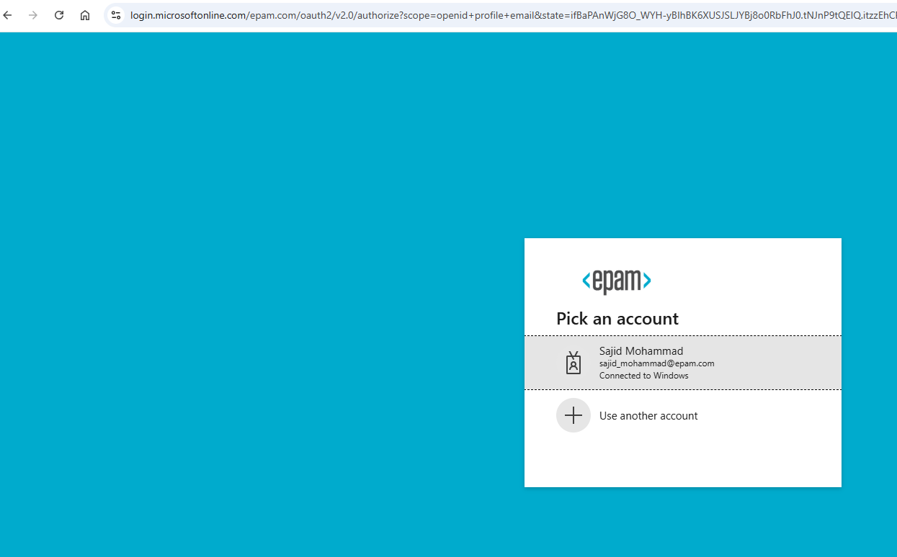

ShiftOps integrates with EPAM's OAuth 2.0 SSO system for secure authentication:

- **Automatic Account Detection** - Your account and team are automatically assigned based on SSO claims
- **Role Mapping** - User roles are synchronized from the corporate directory
- **Session Management** - Secure session handling with automatic timeout

---

### 2.3 Dashboard Overview

> **📌 Page Description:** The Dashboard is the main landing page after login, providing a real-time overview of shift activities, open incidents, pending changes, and quick access to frequently used features.

<!-- 📸 SCREENSHOT: Main dashboard -->
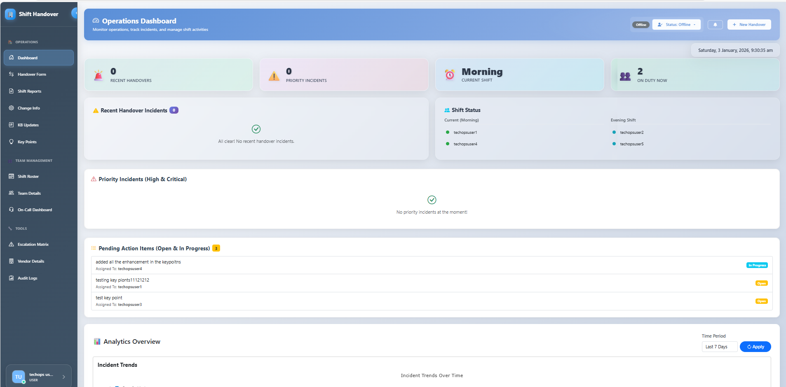

The Dashboard is your central hub for monitoring shift activities:

#### Dashboard Components

| Section | Description |
|---------|-------------|
| **Summary Cards** | Quick stats showing open incidents, pending changes, active key points |
| **Recent Handovers** | List of recently submitted handovers |
| **Pending Assignments** | Incidents assigned to you requiring action |
| **Quick Actions** | Shortcuts to create new handover, view reports |
| **Team Activity** | Recent activity from your team members |

#### Navigation Sidebar

The left sidebar provides access to all application features:

- **Dashboard** - Home screen with summary
- **Operations** - Handover forms and reports
- **Tools** - Change info, KB updates, vendor details
- **Roster** - Shift schedules and team management
- **Support** - OnCall dashboard, escalation matrix
- **Admin** - User management, audit logs (admin only)

---

### 2.4 Multi-Team Access

<!-- 📸 SCREENSHOT: Multi-team access feature -->
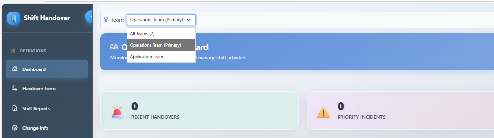

ShiftOps supports multi-team access, allowing users to view and manage data across multiple teams when authorized.

#### Understanding Multi-Team Access

| Access Level | Description |
|--------------|-------------|
| **Single Team** | Default - user sees only their assigned team's data |
| **Multiple Teams** | User can access data from multiple specified teams |
| **All Teams (Account)** | Account admins can see all teams in their account |
| **All Teams (Global)** | Super admins can see all teams across all accounts |

#### Multi-Team View in Reports

<!-- 📸 SCREENSHOT: Multi-team filter in reports -->
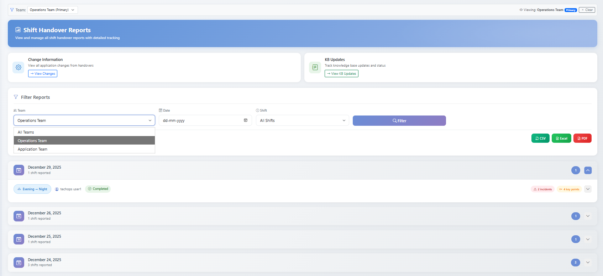

When multi-team access is enabled:

1. **Team Filter** appears in the Reports page
2. Select **specific team** or **"All My Teams"**
3. View consolidated data across teams
4. Export reports for multiple teams

#### Requesting Multi-Team Access

If you need access to additional teams:

1. Contact your **Team Admin** or **Account Admin**
2. Provide business justification
3. Admin will enable access via User Management
4. Access is granted immediately after configuration

#### How Multi-Team Access Works

<!-- 📸 SCREENSHOT: Multi-team configuration -->
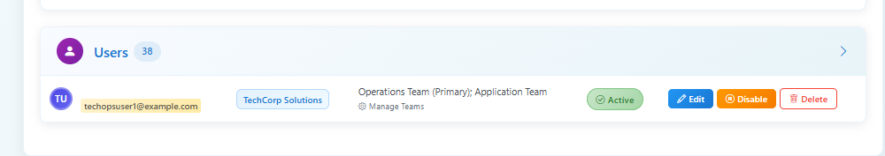

**For Regular Users:**
- Primary team is set during onboarding
- Additional team access granted by admins
- Team selector shows all accessible teams

**For Admins:**
- Team Admins: Access to their team only
- Account Admins: Access to all teams in account
- Super Admins: Access to all teams globally

#### Team Switching

<!-- 📸 SCREENSHOT: Team switcher -->
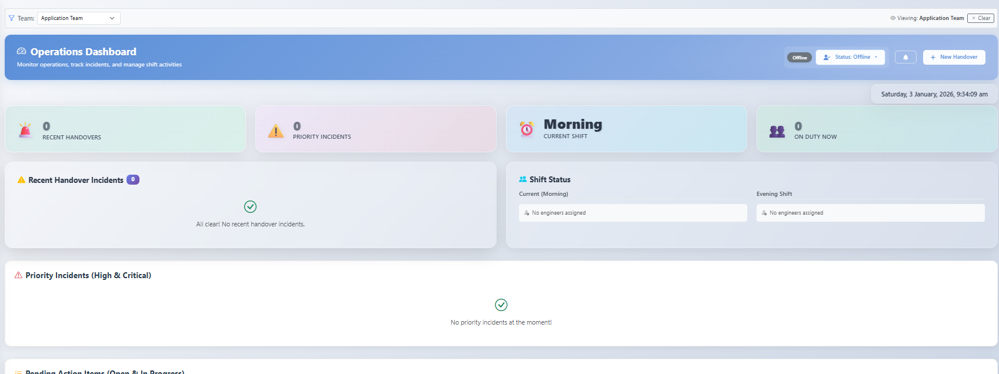

If you have multi-team access:

1. Look for the **Team Selector** dropdown
2. Click to see available teams
3. Select the team to view
4. Page refreshes with selected team's data

> **Note:** Your actions (creating handovers, etc.) are always associated with your primary team unless specifically changed.

#### Multi-Team Export

When exporting reports with multi-team access:

1. Apply team filter (or select "All Teams")
2. Click Export (CSV/Excel/PDF)
3. Export includes data from all selected teams
4. Each record shows which team it belongs to

---

## 3. Operations

### 3.1 Shift Handover Form

> **📌 Page Description:** The Shift Handover Form is the core feature of ShiftOps, allowing engineers to document incidents, key points, scheduled changes, and KB updates when transitioning responsibilities to the next shift team.

<!-- 📸 SCREENSHOT: Handover form page -->
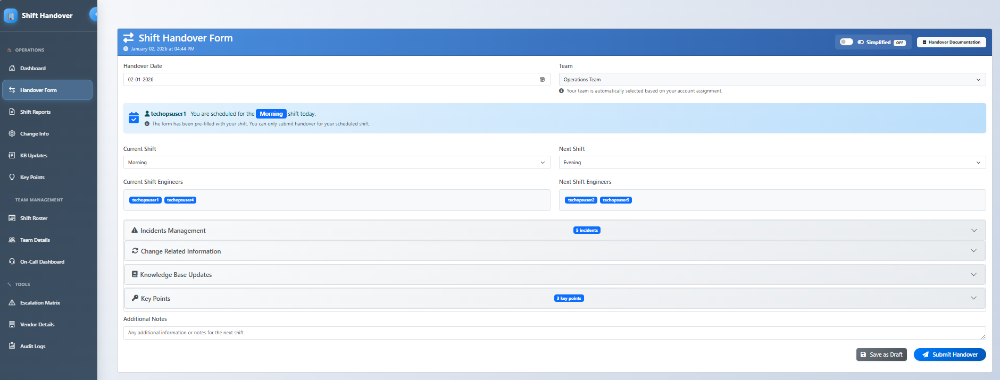

The Shift Handover Form is used to document all important information when transitioning between shifts.

#### Accessing the Form

1. Click **"Handover"** in the sidebar under Operations
2. Or click **"New Handover"** button on the Dashboard

#### Form Sections

##### Shift Information
<!-- 📸 SCREENSHOT: Shift info section -->
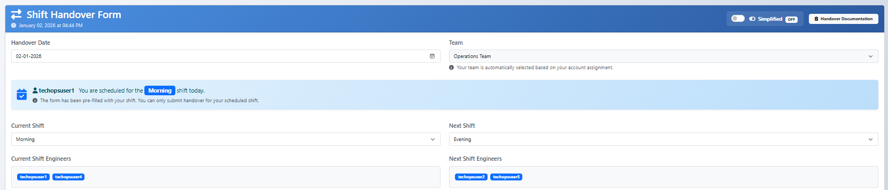

| Field | Description |
|-------|-------------|
| **Handover Date** | Date of the handover (defaults to today) |
| **Current Shift Type** | Your current shift (Morning/Evening/Night/OnShore/OffShore) |
| **Next Shift Type** | The incoming shift type |
| **Current Engineers** | Engineers handing over (auto-populated from roster) |
| **Next Engineers** | Engineers taking over (auto-populated from roster) |

##### Incidents Section
<!-- 📸 SCREENSHOT: Incidents section -->
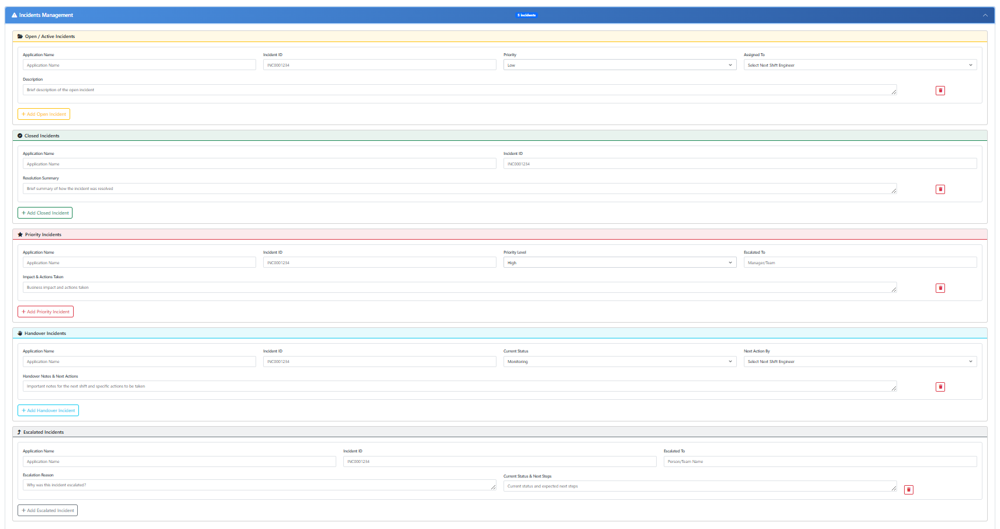

Record all incidents that occurred during the shift:

| Field | Description |
|-------|-------------|
| **Incident Number** | ServiceNow/JIRA incident ID |
| **App Name** | Application affected |
| **Description** | Brief incident description |
| **Status** | Open/In Progress/Resolved/Closed |
| **Escalated To** | Person/team incident was escalated to |

**To add an incident:**
1. Click **"+ Add Incident"** button
2. Fill in the incident details
3. Repeat for additional incidents

##### Key Points Section
<!-- 📸 SCREENSHOT: Key points section -->
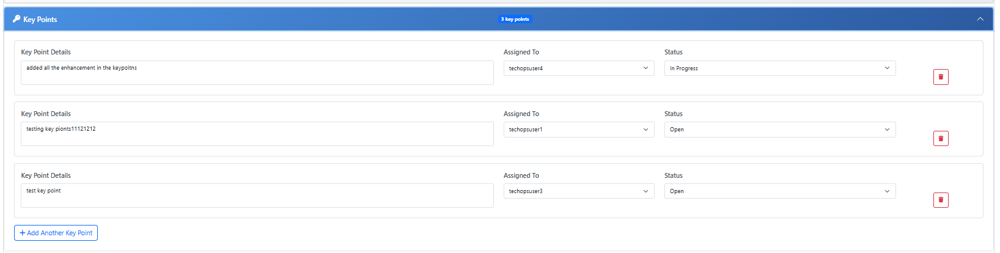

Document important points requiring attention:

| Field | Description |
|-------|-------------|
| **Description** | Key point description |
| **Status** | Open/In Progress/Monitoring/Closed |
| **JIRA ID** | Associated JIRA ticket (optional) |
| **Responsible Engineer** | Person responsible for follow-up |

##### Change Info Section
<!-- 📸 SCREENSHOT: Change info section -->
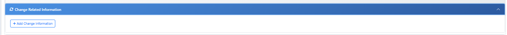

Track scheduled changes:

| Field | Description |
|-------|-------------|
| **Change Number** | Change request number |
| **App Name** | Application being changed |
| **Description** | Change description |
| **Date/Time** | Scheduled implementation time |
| **Responsible Person** | Change implementer |
| **Status** | Scheduled/In Progress/Completed/Cancelled |

##### KB Updates Section
<!-- 📸 SCREENSHOT: KB updates section -->
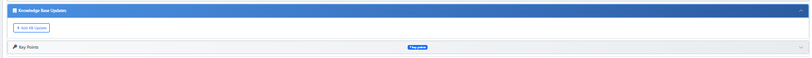

Reference knowledge base articles:

| Field | Description |
|-------|-------------|
| **KB Number** | Knowledge base article ID |
| **Description** | Brief description of the KB |
| **Status** | New/Published/Updated |

##### Additional Notes
<!-- 📸 SCREENSHOT: Additional notes -->
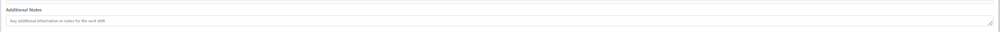

Free-form text area for any additional information not covered in other sections.

#### Saving and Submitting

| Action | Description |
|--------|-------------|
| **Save as Draft** | Save progress without submitting (can edit later) |
| **Submit Handover** | Submit the handover and send email notification |

> **Important:** Once submitted, handovers cannot be edited. Only draft handovers can be modified.

---

### 3.2 Shift Handover Reports

> **📌 Page Description:** The Shift Reports page displays all submitted and draft handover reports with powerful filtering, search, and export capabilities. View historical handovers, track patterns, and export data for analysis.

<!-- 📸 SCREENSHOT: Handover reports list -->
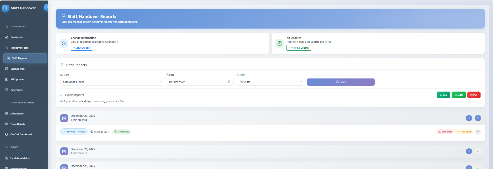

View and analyze all submitted handovers.

#### Accessing Reports

1. Click **"Reports"** in the sidebar under Operations
2. Or click **"View Reports"** on the Dashboard

#### Filtering Reports

<!-- 📸 SCREENSHOT: Report filters -->
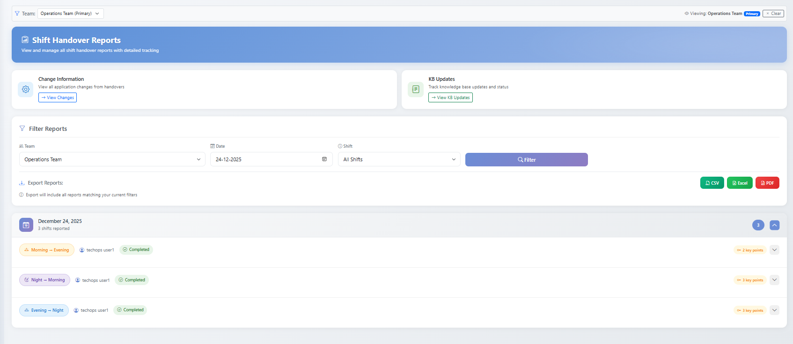

| Filter | Description |
|--------|-------------|
| **Date Range** | Filter by start and end date |
| **Shift Type** | Filter by specific shift (Morning/Evening/Night) |
| **Status** | Filter by draft or submitted |
| **Team** | Filter by team (admin only) |

#### Viewing Report Details

<!-- 📸 SCREENSHOT: Detailed report view -->
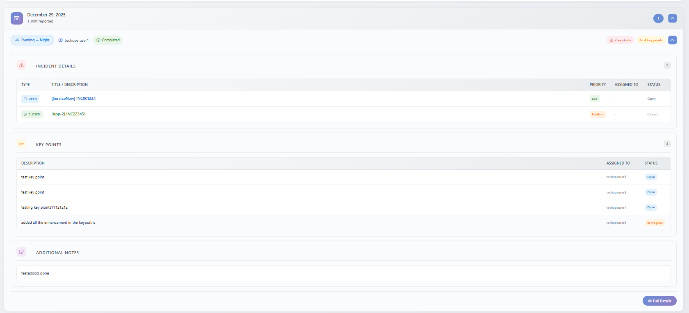

Click on any report row to expand and see:
- All incidents with status
- Key points and updates
- Change information
- KB updates
- Submitted by information

#### Exporting Reports

<!-- 📸 SCREENSHOT: Export buttons -->
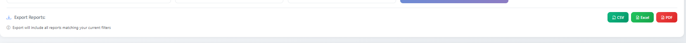

Export reports in multiple formats:

| Format | Description |
|--------|-------------|
| **CSV** | Comma-separated values for Excel/data analysis |
| **Excel** | Formatted Excel workbook with multiple sheets |
| **PDF** | Professional PDF document for printing/sharing |

**To export:**
1. Apply desired filters
2. Click the export button (CSV/Excel/PDF)
3. File will download automatically

#### Deleting Draft Reports (Super Admin Only)

<!-- 📸 SCREENSHOT: Delete draft button -->
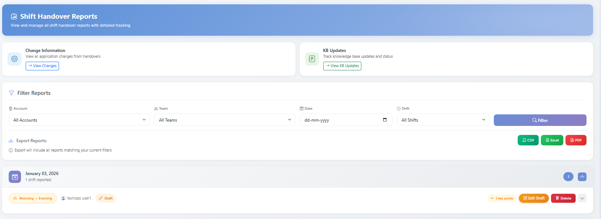

Super administrators can delete draft reports:
1. Find the draft report in the list
2. Click the red **"Delete"** button
3. Confirm deletion in the popup modal

---

### 3.3 Key Points Management

> **📌 Page Description:** The Key Points Management page provides a centralized view of all active and historical key points, allowing teams to track important issues across multiple shifts with timeline-based updates and status tracking.

<!-- 📸 SCREENSHOT: Key points page -->
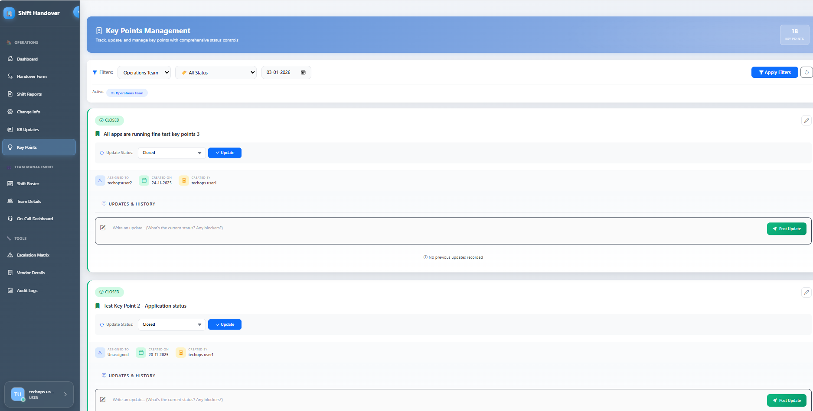

Manage and track key points across shifts.

#### Accessing Key Points

Click **"Key Points"** in the sidebar under Operations

#### Key Points List

<!-- 📸 SCREENSHOT: Key points list with status indicators -->
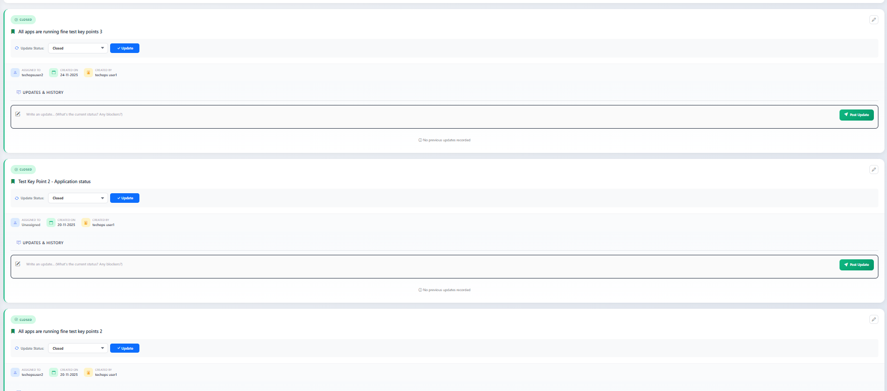

Each key point card shows:
- **Description** - The key point details
- **Status** - Color-coded status badge (Open/In Progress/Monitoring/Closed)
- **Assigned To** - Responsible engineer
- **Created On** - Original creation date
- **JIRA ID** - Associated ticket (if any)

#### Status Colors

| Status | Color | Meaning |
|--------|-------|---------|
| Open | 🔴 Red | New item requiring attention |
| In Progress | 🟡 Yellow | Being actively worked on |
| Monitoring | 🔵 Blue | Under observation |
| Closed | 🟢 Green | Resolved and completed |

#### Adding Updates

<!-- 📸 SCREENSHOT: Add update form -->
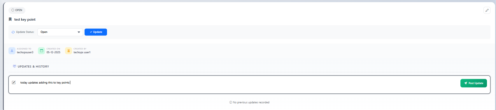

1. Click on a key point card to expand
2. Enter your update in the text box
3. Select new status (optional)
4. Click **"Post Update"**

#### Update Timeline

Each key point maintains a timeline of all updates with:
- Update text
- Author name
- Timestamp
- Status change (if any)

---

## 4. Tools

### 4.1 Change Info Management

> **📌 Page Description:** The Change Info page allows teams to manage scheduled changes independently of handovers. Add, edit, and track change requests with status updates, ensuring visibility of all planned changes across shifts.

<!-- 📸 SCREENSHOT: Change info page -->
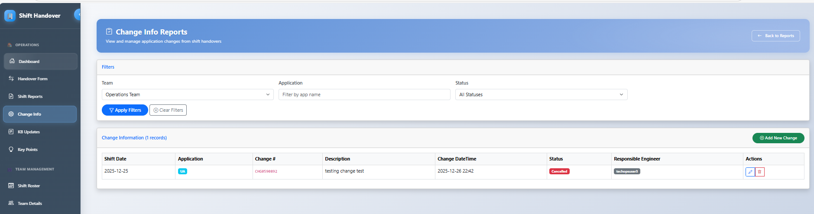

Manage scheduled changes independently of handovers.

#### Accessing Change Info

Click **"Change Info"** in the sidebar under Tools

#### Change Info Features

| Feature | Description |
|---------|-------------|
| **Add New Change** | Create change records outside of handover |
| **Edit Changes** | Update change details and status |
| **Delete Changes** | Remove cancelled or duplicate changes |
| **Filter by Status** | View only active/pending changes |

#### Adding a New Change

<!-- 📸 SCREENSHOT: Add change form -->
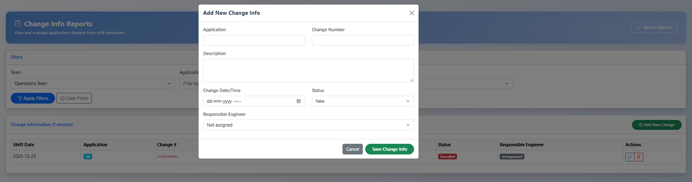

1. Click **"+ Add Change"** button
2. Fill in the change details:
   - Change Number
   - Application Name
   - Description
   - Scheduled Date/Time
   - Responsible Person
   - Status
3. Click **"Save"**

---

### 4.2 KB Updates

> **📌 Page Description:** The KB Updates page tracks knowledge base articles that have been created, updated, or retired. Teams can add new KB references and maintain a history of documentation changes.

<!-- 📸 SCREENSHOT: KB updates page -->
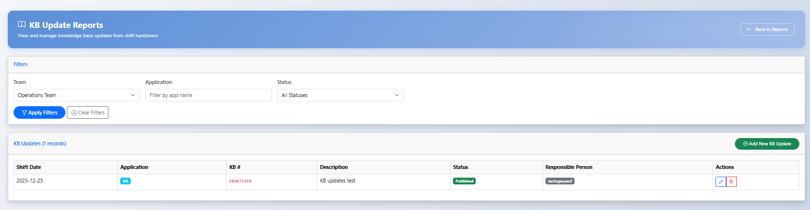

Manage knowledge base article references.

#### Accessing KB Updates

Click **"KB Updates"** in the sidebar under Tools

#### KB Status Types

| Status | Description |
|--------|-------------|
| **New** | Recently added KB article |
| **Published** | KB article is live and available |
| **Updated** | Existing KB has been modified |
| **Retired** | KB is no longer relevant |

#### Adding a KB Entry

1. Click **"+ Add KB"** button
2. Enter KB Number and Description
3. Select Status
4. Click **"Save"**

---

### 4.3 Vendor Details

> **📌 Page Description:** The Vendor Details page maintains a directory of third-party vendor contacts, including support numbers, emails, and SLA information for quick reference during incidents and escalations.

<!-- 📸 SCREENSHOT: Vendor details page -->
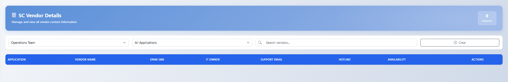

Store and access vendor contact information.

#### Accessing Vendor Details

Click **"Vendor Details"** in the sidebar under Tools

#### Vendor Information

Each vendor entry includes:
- **Vendor Name** - Company name
- **Contact Person** - Primary contact name
- **Email** - Contact email address
- **Phone** - Contact phone number
- **Services** - Services provided
- **Contract Details** - Contract expiry, SLA information

---

### 4.4 CTask Assignment

> **📌 Page Description:** The CTask Assignment page manages ServiceNow change tasks, showing task assignments, due dates, and completion status. Teams can track implementation responsibilities and update task progress.

<!-- 📸 SCREENSHOT: CTask assignment page -->
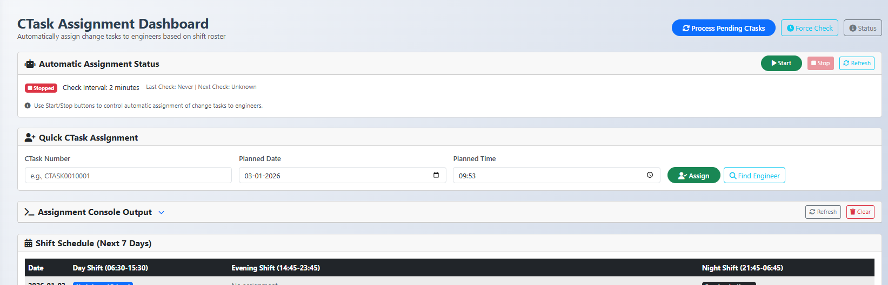

Manage change task assignments and track implementation responsibilities.

#### Accessing CTask Assignment

Click **"CTask Assignment"** in the sidebar under Tools

#### CTask Features

| Feature | Description |
|---------|-------------|
| **View CTasks** | List of change tasks assigned to team |
| **Assignment Status** | Track who is responsible for each task |
| **Due Dates** | See upcoming task deadlines |
| **Status Updates** | Update task completion status |

#### CTask List View

<!-- 📸 SCREENSHOT: CTask list -->
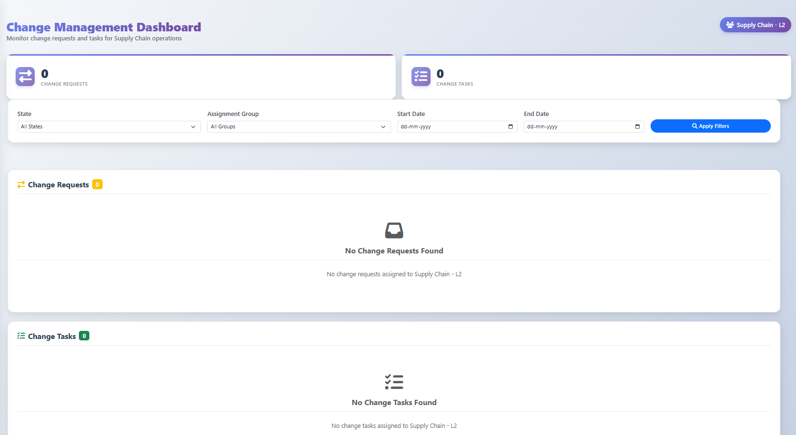

The CTask list shows:
- **Task Number** - CTask identifier
- **Description** - Task description
- **Assigned To** - Responsible engineer
- **Due Date** - Expected completion date
- **Status** - Not Started/In Progress/Completed

#### Updating CTask Status

1. Find the CTask in the list
2. Click on the task row
3. Update the status
4. Add any notes
5. Click **"Save"**

---

## 5. Roster & Scheduling

### 5.1 Shift Roster

> **📌 Page Description:** The Shift Roster page displays a calendar-based view of shift schedules, showing which engineers are assigned to each shift (Morning, Evening, Night, OnShore, OffShore) for the selected month and year.

<!-- 📸 SCREENSHOT: Shift roster page -->
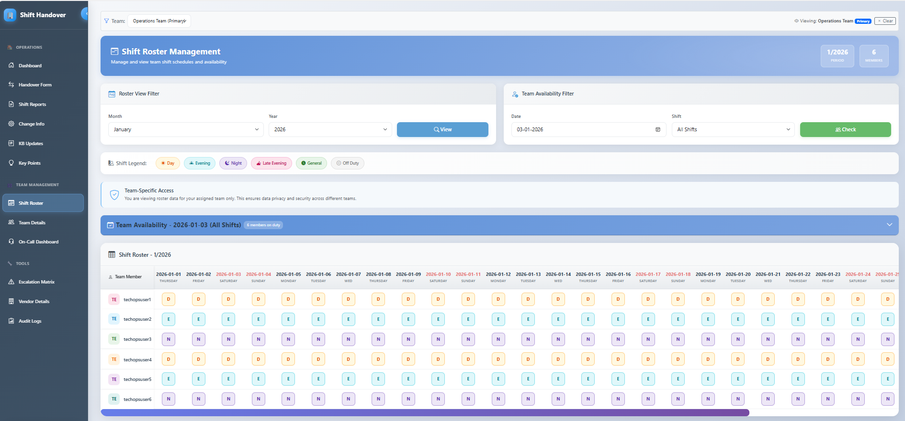

View and manage shift schedules.

#### Accessing Shift Roster

Click **"Shift Roster"** in the sidebar under Roster

#### Roster Calendar View

<!-- 📸 SCREENSHOT: Roster calendar -->
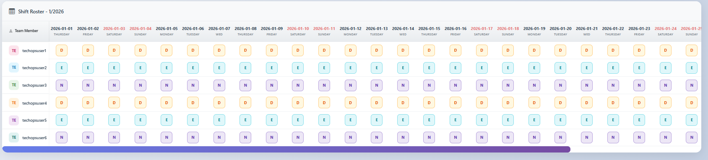

The calendar displays:
- **Color-coded shifts** - Different colors for Morning/Evening/Night
- **Engineer assignments** - Names displayed in each shift cell
- **Leave indicators** - Engineers on leave are marked

#### Filtering the Roster

| Filter | Description |
|--------|-------------|
| **Month** | Select month to view |
| **Year** | Select year (including past years) |
| **Team** | Filter by specific team |

#### Shift Allowance Report

<!-- 📸 SCREENSHOT: Shift allowance modal -->
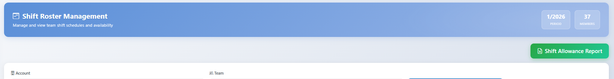

Generate shift allowance reports:
1. Click **"Shift Allowance"** button
2. Select Month and Year
3. Click **"Generate Report"**
4. Download the Excel file

---

### 5.2 Team Details

> **📌 Page Description:** The Team Details page shows comprehensive information about your team, including team members, their roles, contact information, and organizational structure.

<!-- 📸 SCREENSHOT: Team details page -->
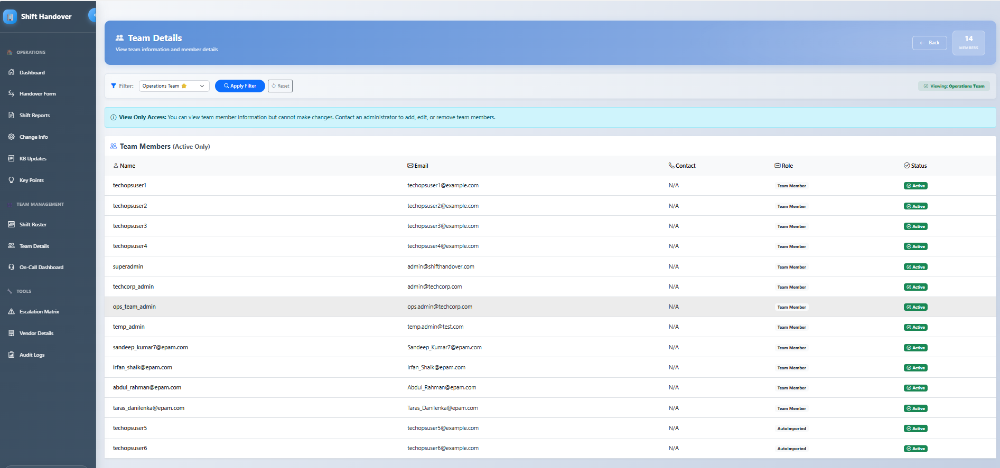

View team information and members.

#### Accessing Team Details

Click **"Team Details"** in the sidebar under Roster

#### Team Information

- **Team Name** - Full team name
- **Account** - Parent account/organization
- **Team Members** - List of all team members
- **Contact Information** - Team lead, email distribution list

---

### 5.3 Shift Management

> **📌 Page Description:** The Shift Management page provides advanced tools for shift planning, coverage analysis, and shift swap coordination. Administrators can analyze shift patterns and ensure adequate coverage.

<!-- 📸 SCREENSHOT: Shift management dashboard -->

Advanced shift planning and management features.

#### Accessing Shift Management

Click **"Shift Management"** in the sidebar under Roster

#### Shift Management Features

| Feature | Description |
|---------|-------------|
| **Shift Overview** | Visual overview of all shifts |
| **Shift Planning** | Plan shifts in advance |
| **Coverage Analysis** | Ensure adequate shift coverage |
| **Shift Swaps** | Request and approve shift swaps |

#### Shift Calendar

<!-- 📸 SCREENSHOT: Shift management calendar -->

The shift calendar provides:
- Weekly/Monthly view options
- Drag-and-drop shift assignments
- Conflict detection
- Coverage gaps highlighting

#### Shift Statistics

View shift statistics including:
- Total shifts per engineer
- Overtime tracking
- Leave balance
- Coverage percentage

---

## 6. Support Tools

### 6.1 OnCall Dashboard

> **📌 Page Description:** The OnCall Dashboard displays the current on-call engineer(s) for each team, their contact information, and the on-call rotation schedule for quick access during incidents.

<!-- 📸 SCREENSHOT: OnCall dashboard -->
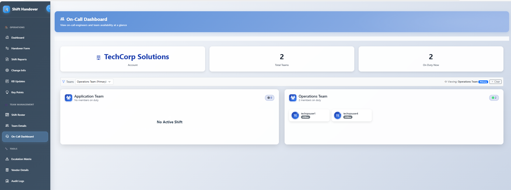

View current on-call engineers and schedules.

#### Accessing OnCall Dashboard

Click **"OnCall Dashboard"** in the sidebar under Support

#### Dashboard Features

| Feature | Description |
|---------|-------------|
| **Current On-Call** | Who is currently on call |
| **Contact Info** | Phone numbers and emails |
| **Schedule** | Upcoming on-call rotation |
| **Escalation Path** | Quick access to escalation contacts |

---

### 6.2 Escalation Matrix

> **📌 Page Description:** The Escalation Matrix provides a structured hierarchy of escalation contacts (L1, L2, L3, Management) with contact details for efficient incident escalation and communication.

<!-- 📸 SCREENSHOT: Escalation matrix -->
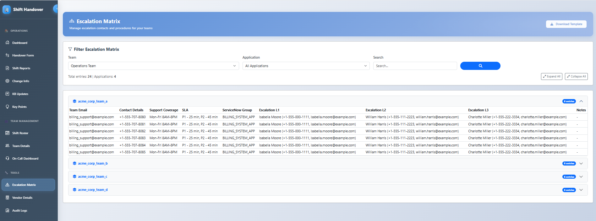

Quick reference for escalation contacts.

#### Accessing Escalation Matrix

Click **"Escalation Matrix"** in the sidebar under Support

#### Escalation Levels

| Level | Description | Typical Contacts |
|-------|-------------|------------------|
| **L1** | First level support | Team members |
| **L2** | Second level support | Senior engineers |
| **L3** | Third level support | Technical leads |
| **Management** | Management escalation | Managers, Directors |

---

### 6.3 ServiceNow Integration

> **📌 Page Description:** The ServiceNow Integration page allows direct lookup of incidents and change requests from ServiceNow, enabling auto-population of handover forms with accurate ticket information.

<!-- 📸 SCREENSHOT: ServiceNow integration page -->
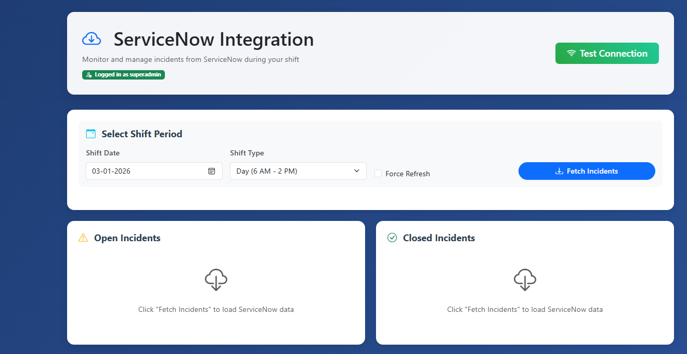

Access ServiceNow data directly from ShiftOps.

#### Accessing ServiceNow Integration

Click **"ServiceNow Integration"** in the sidebar under Support

#### ServiceNow Features

| Feature | Description |
|---------|-------------|
| **Incident Lookup** | Search for incidents by number |
| **Change Lookup** | Search for change requests |
| **Auto-populate** | Pull incident details into handover form |
| **Status Sync** | View real-time incident status |

#### Using ServiceNow Lookup

1. Navigate to ServiceNow Integration
2. Enter incident or change number
3. Click **"Search"**
4. View details retrieved from ServiceNow
5. Click **"Add to Handover"** to use in handover form

> **Note:** ServiceNow integration requires configuration by your administrator.

---

## 7. Knowledge Base

### 7.1 KB Articles

> **📌 Page Description:** The KB Articles page is a searchable repository of knowledge base articles, providing teams with documented solutions, procedures, and reference materials for common issues.

<!-- 📸 SCREENSHOT: KB Articles page -->

Access and manage knowledge base articles.

#### Accessing KB Articles

Click **"KB Articles"** in the sidebar under Knowledge Base

#### KB Article Features

| Feature | Description |
|---------|-------------|
| **View Articles** | Browse available KB articles |
| **Search** | Search articles by keyword |
| **Categories** | Filter by category |
| **Recent** | View recently updated articles |

#### KB Article Details

<!-- 📸 SCREENSHOT: KB article detail -->

Each article shows:
- **KB Number** - Article identifier
- **Title** - Article title
- **Description** - Full article content
- **Category** - Article category
- **Status** - Published/Draft/Retired
- **Last Updated** - When article was modified

---

### 7.2 Applications

> **📌 Page Description:** The Applications page maintains a registry of all supported applications, including ownership, support contacts, documentation links, and technical details.

<!-- 📸 SCREENSHOT: Applications page -->

View and manage application information.

#### Accessing Applications

Click **"Applications"** in the sidebar under Knowledge Base

#### Application Details

| Field | Description |
|-------|-------------|
| **App Name** | Application name |
| **Description** | Application description |
| **Owner** | Application owner/team |
| **Support Contact** | Support contact information |
| **Documentation** | Links to documentation |

---

### 7.3 Change Management Dashboard

> **📌 Page Description:** The Change Management Dashboard provides a visual calendar and analytics of scheduled changes, including risk distribution, success rates, and upcoming change windows.

<!-- 📸 SCREENSHOT: Change management dashboard -->

Comprehensive view of change activities.

#### Accessing Change Management

Click **"Change Management"** in the sidebar under Knowledge Base

#### Dashboard Features

| Feature | Description |
|---------|-------------|
| **Change Calendar** | Visual calendar of scheduled changes |
| **Upcoming Changes** | List of changes in next 7 days |
| **Change Statistics** | Success rate, volume trends |
| **Risk Analysis** | Change risk distribution |

#### Change Views

<!-- 📸 SCREENSHOT: Change calendar view -->

- **Calendar View** - Changes displayed on calendar
- **List View** - Sortable list of all changes
- **Timeline View** - Chronological timeline

---

## 8. Administration

> **Note:** Administration features are only available to users with Admin or Super Admin roles.

### 8.1 User Management

> **📌 Page Description:** The User Management page allows administrators to view, create, edit, and deactivate user accounts, assign roles, and manage access permissions across the system.

<!-- 📸 SCREENSHOT: User management page -->
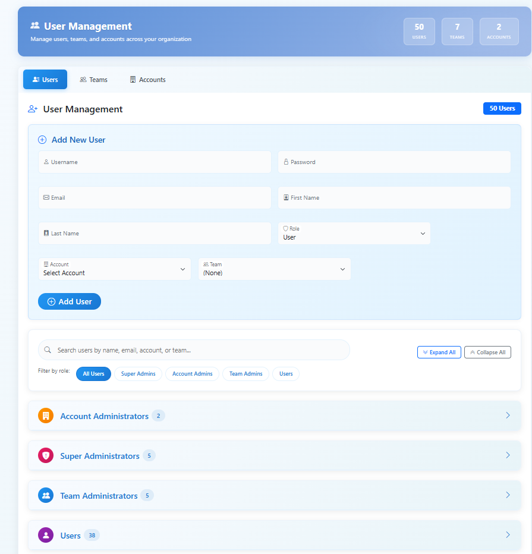

Manage application users.

#### Accessing User Management

Click **"User Management"** in the sidebar under Admin

#### User Actions

| Action | Description |
|--------|-------------|
| **Add User** | Create new user account |
| **Edit User** | Modify user details and role |
| **Deactivate User** | Disable user access |
| **Reset Password** | Reset user's password |

#### User Roles

| Role | Permissions |
|------|-------------|
| **User** | View and create handovers for own team |
| **Team Admin** | Manage team members, view team reports |
| **Account Admin** | Manage all teams in account |
| **Super Admin** | Full system access |

---

### 8.2 Audit Logs

> **📌 Page Description:** The Audit Logs page records all system activities including user actions, login events, configuration changes, and data modifications for security monitoring and compliance.

<!-- 📸 SCREENSHOT: Audit logs page -->
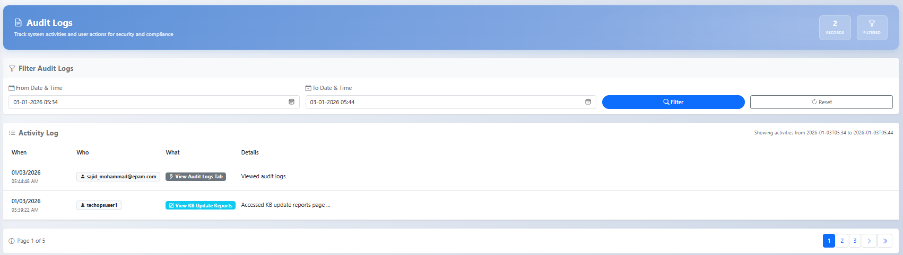

View system activity logs.

#### Accessing Audit Logs

Click **"Audit Logs"** in the sidebar under Admin

#### Log Information

Each log entry includes:
- **Timestamp** - When the action occurred
- **User** - Who performed the action
- **Action** - What action was taken
- **Details** - Additional context
- **IP Address** - Source IP (if available)

#### Filtering Logs

- Filter by date range
- Filter by user
- Filter by action type
- Search by keyword

---

## 9. Account Settings

### 9.1 My Profile

> **📌 Page Description:** The My Profile page displays your personal information, role, team assignment, and allows you to update your name, email, and change your password.

<!-- 📸 SCREENSHOT: My profile page -->
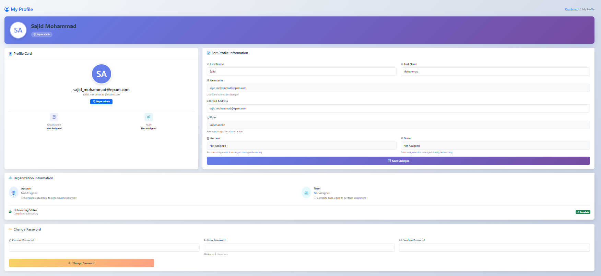

View and edit your personal information.

#### Accessing My Profile

Click your avatar/name in the sidebar → **"My Profile"**

#### Profile Information

| Field | Editable | Description |
|-------|----------|-------------|
| **First Name** | ✅ Yes | Your first name |
| **Last Name** | ✅ Yes | Your last name |
| **Email** | ✅ Yes | Your email address |
| **Username** | ❌ No | Login username |
| **Role** | ❌ No | Assigned by admin |
| **Account** | ❌ No | Organization assignment |
| **Team** | ❌ No | Team assignment |

#### Changing Password

<!-- 📸 SCREENSHOT: Change password section -->
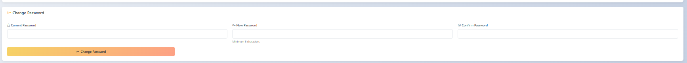

1. Scroll to **"Change Password"** section
2. Enter your **Current Password**
3. Enter **New Password** (min 6 characters)
4. **Confirm New Password**
5. Click **"Change Password"**

---

### 9.2 Account Settings

> **📌 Page Description:** The Account Settings page shows your session information, notification preferences, security settings, and provides quick actions for account management.

<!-- 📸 SCREENSHOT: Account settings page -->
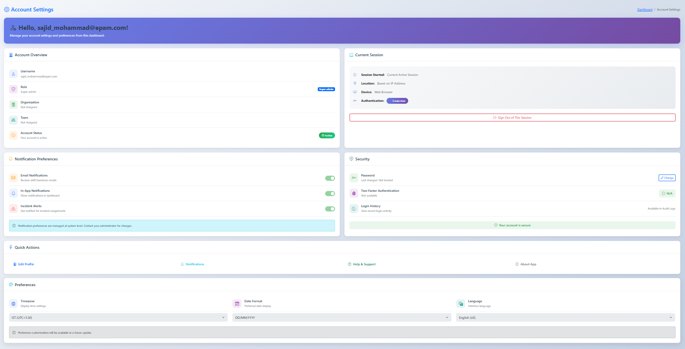

View account configuration and preferences.

#### Accessing Account Settings

Click your avatar/name in the sidebar → **"Account Settings"**

#### Settings Sections

| Section | Description |
|---------|-------------|
| **Account Overview** | Username, role, organization, team |
| **Current Session** | Session info, device, auth type |
| **Notification Preferences** | Email and in-app notification settings |
| **Security** | Password management, 2FA status |
| **Preferences** | Timezone, date format, language |

---

### 9.3 Notifications

> **📌 Page Description:** The Notifications page displays all your handover notifications, incident assignments, and system announcements with read/unread status and priority indicators.

<!-- 📸 SCREENSHOT: Notifications page -->
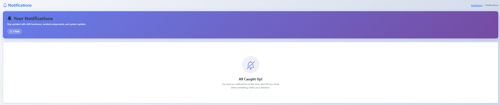

View all your notifications.

#### Accessing Notifications

Click your avatar/name in the sidebar → **"Notifications"**

Or click the bell icon in the header

#### Notification Types

| Type | Description |
|------|-------------|
| **Handover** | New handover submitted by team member |
| **Incident Assignment** | Incident assigned to you |
| **System** | System announcements and updates |

#### Notification Actions

- **View Details** - Click notification to see full details
- **Mark as Read** - Individual notifications marked when viewed
- **Mark All Read** - Button to mark all as read

---

### 9.4 System Alerts

> **📌 Page Description:** The System Alerts page shows real-time system health status for database, email service, and application, along with dynamic alerts based on current metrics.

<!-- 📸 SCREENSHOT: System alerts page -->
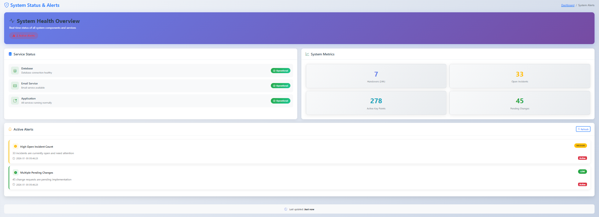

View system health and alerts.

#### Accessing System Alerts

Click your avatar/name in the sidebar → **"System Alerts"**

#### System Status

| Service | Status Indicators |
|---------|-------------------|
| **Database** | Connection health |
| **Email Service** | SMTP availability |
| **Application** | Overall app health |

#### System Metrics

Real-time metrics displayed:
- Handovers in last 24 hours
- Open incidents count
- Active key points
- Pending changes

#### Active Alerts

System automatically generates alerts for:
- Database connectivity issues
- High open incident counts
- Many pending changes

---

## 10. Help & Support

> **📌 Page Description:** The Help & Support page provides FAQs, contact information for technical support (email and phone), links to documentation, and quick answers to common questions.

<!-- 📸 SCREENSHOT: Help & support page -->
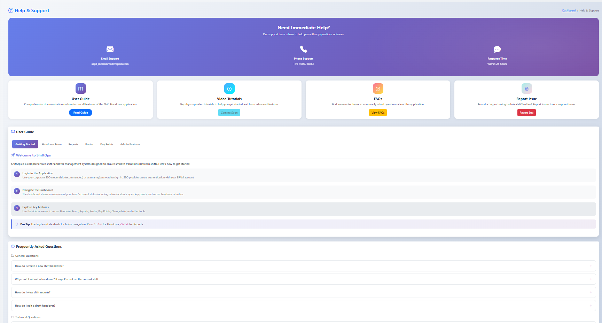

Access help resources and contact support.

#### Accessing Help & Support

Click your avatar/name in the sidebar → **"Help & Support"**

#### Support Resources

| Resource | Description |
|----------|-------------|
| **FAQs** | Frequently asked questions |
| **User Guide** | This documentation |
| **Email Support** | sajid_mohammad@epam.com |
| **Phone Support** | +91-9505788866 |

#### FAQ Topics

- Creating handovers
- Viewing reports
- Managing rosters
- Exporting data
- Troubleshooting

---

## 11. About

> **📌 Page Description:** The About page displays application version information, release date, technology stack details, developer information (EPAM Systems), and system environment.

<!-- 📸 SCREENSHOT: About page -->
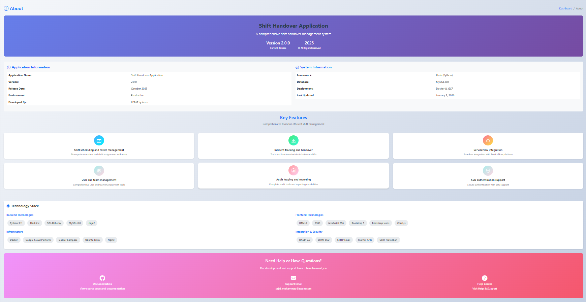

View application information.

#### Accessing About

Click your avatar/name in the sidebar → **"About"**

#### Application Information

| Field | Value |
|-------|-------|
| **Application Name** | Shift Handover Application |
| **Version** | 2.0.0 |
| **Release Date** | October 2025 |
| **Environment** | Production |
| **Developed By** | EPAM Systems |

#### Technology Stack

**Backend:**
- Python 3.11
- Flask 2.x
- SQLAlchemy
- MySQL 8.0

**Frontend:**
- HTML5, CSS3, JavaScript ES6
- Bootstrap 5
- Bootstrap Icons
- Chart.js

**Infrastructure:**
- Docker
- Google Cloud Platform
- Nginx

**Security:**
- OAuth 2.0
- EPAM SSO
- CSRF Protection

---

## Appendix A: Keyboard Shortcuts

| Shortcut | Action |
|----------|--------|
| `Ctrl + S` | Save draft (on handover form) |
| `Ctrl + Enter` | Submit form |
| `Escape` | Close modal/popup |

---

## Appendix B: Troubleshooting

### Common Issues

#### Cannot Login

1. **Check credentials** - Ensure username and password are correct
2. **Check account/team selection** - Make sure correct account and team are selected
3. **Clear browser cache** - Try clearing cookies and cache
4. **Contact admin** - If issue persists, contact your administrator

#### Handover Not Submitting

1. **Check required fields** - Ensure all required fields are filled
2. **Verify shift selection** - Make sure you're on the correct shift
3. **Check network** - Ensure stable internet connection

#### Export Not Working

1. **Check filters** - Ensure date range has data
2. **Try different format** - If one format fails, try another
3. **Check browser** - Ensure pop-ups are not blocked

---

## Appendix C: Glossary

| Term | Definition |
|------|------------|
| **Handover** | The process of transferring shift responsibilities |
| **Incident** | An unplanned interruption or reduction in quality of service |
| **Key Point** | Important item requiring attention or follow-up |
| **Change** | A scheduled modification to the system |
| **KB** | Knowledge Base article |
| **Roster** | Schedule of shift assignments |
| **SSO** | Single Sign-On authentication |

---

## Document History

| Version | Date | Changes |
|---------|------|---------|
| 2.0.0 | Jan 2, 2026 | Complete documentation rewrite |
| 1.0.0 | Oct 2025 | Initial documentation |

---

**© 2026 EPAM Systems. All Rights Reserved.**

*For questions about this documentation, contact: sajid_mohammad@epam.com*

